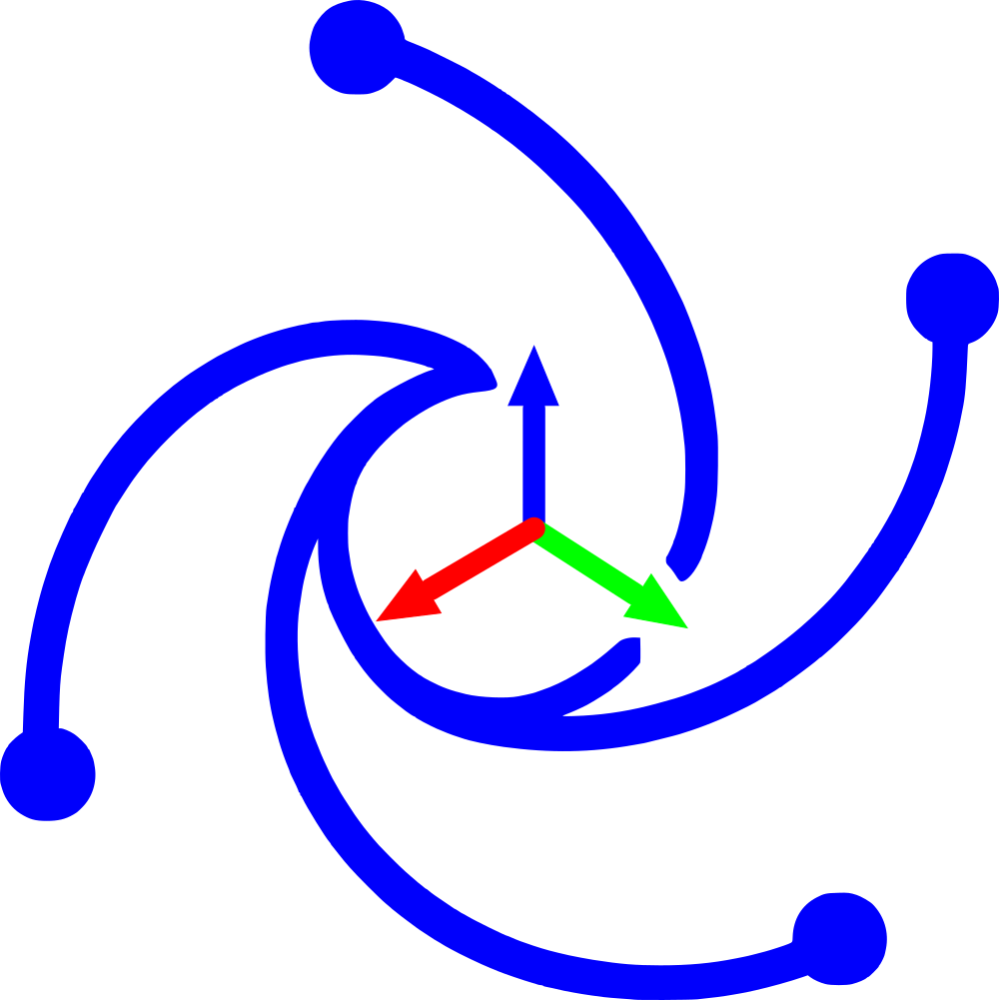
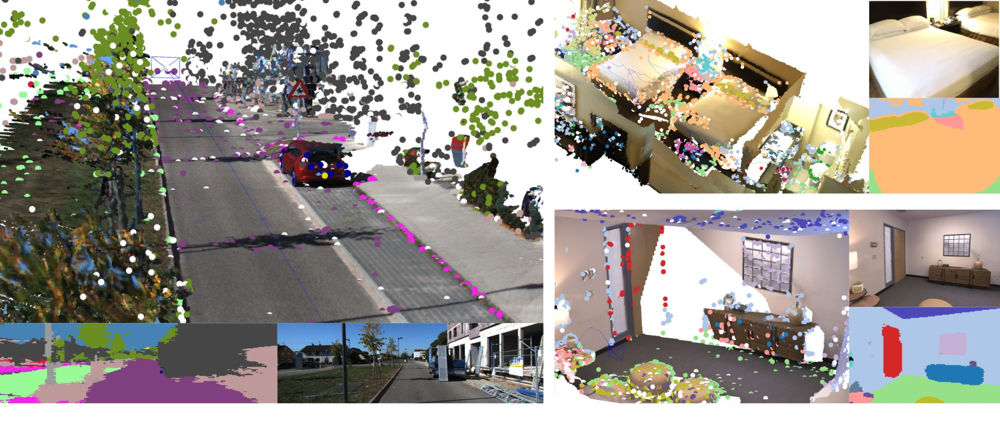

<p align="center"></p>

# pySLAM v2.9.0

Author: **[Luigi Freda](https://www.luigifreda.com)**

 
**pySLAM** is a python implementation of a *Visual SLAM* pipeline that supports **monocular**, **stereo** and **RGBD** cameras. It provides the following features in a **single python environment**:
- A wide range of classical and modern **[local features](#supported-local-features)** with a convenient interface for their integration.
- Multiple loop closing methods, including **[descriptor aggregators](#supported-global-descriptors-and-local-descriptor-aggregation-methods)** such as visual Bag of Words (BoW, iBow), Vector of Locally Aggregated Descriptors (VLAD) and modern **[global descriptors](#supported-global-descriptors-and-local-descriptor-aggregation-methods)** (image-wise descriptors).
- A **[volumetric reconstruction pipeline](#volumetric-reconstruction)** that processes depth and color images using volumetric integration to produce dense reconstructions. It supports **TSDF** with voxel hashing and incremental **Gaussian Splatting**. 
- Integration of **[depth prediction models](#depth-prediction)** within the SLAM pipeline. These include DepthPro, DepthAnythingV2, RAFT-Stereo, CREStereo, etc.  
- A suite of segmentation models for **[semantic understanding](#semantic-mapping)** of the scene, such as DeepLabv3, Segformer, and dense CLIP.
- Additional tools for VO (Visual Odometry) and SLAM, with built-in support for both **g2o** and **GTSAM**, along with custom Python bindings for features not available in the original libraries.
- Built-in support for over [10 dataset types](#datasets).

pySLAM serves as a flexible baseline framework to experiment with VO/SLAM techniques, *[local features](#supported-local-features)*, *[descriptor aggregators](#supported-global-descriptors-and-local-descriptor-aggregation-methods)*, *[global descriptors](#supported-global-descriptors-and-local-descriptor-aggregation-methods)*, *[volumetric integration](#volumetric-reconstruction-pipeline)*, *[depth prediction](#depth-prediction)* and *[semantic mapping](#semantic-mapping)*. It allows to explore, prototype and develop VO/SLAM pipelines. pySLAM is a research framework and a work in progress. It is not optimized for real-time performance.   

**Enjoy it!**

<p align="center">
            
</p>

## Table of contents

<!-- TOC -->

- [pySLAM v2.9.0](#pyslam-v290)
    - [1. Table of contents](#1-table-of-contents)
    - [2. Overview](#2-overview)
        - [2.1. Main Scripts](#21-main-scripts)
        - [2.2. System overview](#22-system-overview)
    - [3. Install](#3-install)
        - [3.1. Main requirements](#31-main-requirements)
        - [3.2. Ubuntu](#32-ubuntu)
        - [3.3. MacOS](#33-macos)
        - [3.4. Docker](#34-docker)
        - [3.5. How to install non-free OpenCV modules](#35-how-to-install-non-free-opencv-modules)
        - [3.6. Troubleshooting and performance issues](#36-troubleshooting-and-performance-issues)
    - [4. Usage](#4-usage)
        - [4.1. Visual odometry](#41-visual-odometry)
        - [4.2. Full SLAM](#42-full-slam)
        - [4.3. Selecting a dataset and different configuration parameters](#43-selecting-a-dataset-and-different-configuration-parameters)
        - [4.4. Feature tracking](#44-feature-tracking)
        - [4.5. Loop closing and relocalization](#45-loop-closing-and-relocalization)
            - [4.5.1. Vocabulary management](#451-vocabulary-management)
            - [4.5.2. Vocabulary-free loop closing](#452-vocabulary-free-loop-closing)
            - [4.5.3. Verify your loop detection configuration and verify vocabulary compability](#453-verify-your-loop-detection-configuration-and-verify-vocabulary-compability)
                - [4.5.3.1. Loop detection method based on a pre-trained vocabulary](#4531-loop-detection-method-based-on-a-pre-trained-vocabulary)
                - [4.5.3.2. Missing vocabulary for the selected front-end descriptor type](#4532-missing-vocabulary-for-the-selected-front-end-descriptor-type)
        - [4.6. Volumetric reconstruction](#46-volumetric-reconstruction)
            - [4.6.1. Dense reconstruction while running SLAM](#461-dense-reconstruction-while-running-slam)
            - [4.6.2. Reload a saved sparse map and perform dense reconstruction](#462-reload-a-saved-sparse-map-and-perform-dense-reconstruction)
            - [4.6.3. Reload and check your dense reconstruction](#463-reload-and-check-your-dense-reconstruction)
            - [4.6.4. Controlling the spatial distribution of keyframe FOV centers](#464-controlling-the-spatial-distribution-of-keyframe-fov-centers)
        - [4.7. Depth prediction](#47-depth-prediction)
        - [4.8. Semantic mapping](#48-semantic-mapping)
        - [4.9. Saving and reloading](#49-saving-and-reloading)
            - [4.9.1. Save the a map](#491-save-the-a-map)
            - [4.9.2. Reload a saved map and relocalize in it](#492-reload-a-saved-map-and-relocalize-in-it)
            - [4.9.3. Trajectory saving](#493-trajectory-saving)
        - [4.10. Graph optimization engines](#410-graph-optimization-engines)
        - [4.11. SLAM GUI](#411-slam-gui)
        - [4.12. Monitor the logs of tracking, local mapping, loop closing and volumetric mapping simultaneously](#412-monitor-the-logs-of-tracking-local-mapping-loop-closing-and-volumetric-mapping-simultaneously)
        - [4.13. Evaluating SLAM](#413-evaluating-slam)
            - [4.13.1. Run a SLAM evaluation](#4131-run-a-slam-evaluation)
            - [4.13.2. pySLAM performances and comparative evaluations](#4132-pyslam-performances-and-comparative-evaluations)
    - [5. Supported components and models](#5-supported-components-and-models)
        - [5.1. Supported local features](#51-supported-local-features)
        - [5.2. Supported matchers](#52-supported-matchers)
        - [5.3. Supported global descriptors and local descriptor aggregation methods](#53-supported-global-descriptors-and-local-descriptor-aggregation-methods)
                - [5.3.1. Local descriptor aggregation methods](#531-local-descriptor-aggregation-methods)
                - [5.3.2. Global descriptors](#532-global-descriptors)
        - [5.4. Supported depth prediction models](#54-supported-depth-prediction-models)
        - [5.5. Supported volumetric mapping methods](#55-supported-volumetric-mapping-methods)
        - [5.6. Supported semantic segmentation methods](#56-supported-semantic-segmentation-methods)
    - [6. Configuration](#6-configuration)
        - [6.1. Main configuration file](#61-main-configuration-file)
        - [6.2. Datasets](#62-datasets)
            - [6.2.1. KITTI Datasets](#621-kitti-datasets)
            - [6.2.2. TUM Datasets](#622-tum-datasets)
            - [6.2.3. ICL-NUIM Datasets](#623-icl-nuim-datasets)
            - [6.2.4. EuRoC Datasets](#624-euroc-datasets)
            - [6.2.5. Replica Datasets](#625-replica-datasets)
            - [6.2.6. Tartanair Datasets](#626-tartanair-datasets)
            - [6.2.7. ScanNet Datasets](#627-scannet-datasets)
            - [6.2.8. ROS1 bags](#628-ros1-bags)
            - [6.2.9. ROS2 bags](#629-ros2-bags)
            - [6.2.10. Video and Folder Datasets](#6210-video-and-folder-datasets)
        - [6.3. Camera Settings](#63-camera-settings)
    - [7. References](#7-references)
    - [8. Credits](#8-credits)
    - [9. License](#9-license)
    - [10. Contributing to pySLAM](#10-contributing-to-pyslam)
    - [11. Roadmap](#11-roadmap)

<!-- /TOC -->

## Overview

```bash
├── cpp         # Pybind11 C++ bindings
├── data        # Sample input/output data
├── docs        # Documentation files
├── pyslam      # Core Python package
│   ├── dense
│   ├── depth_estimation
│   ├── evaluation
│   ├── io
│   ├── local_features
│   ├── loop_closing
│   ├── semantics
│   ├── slam
│   ├── utilities
│   ├── viz
├── scripts     # Shell utility scripts
├── settings    # Dataset/configuration files
├── test        # Tests and usage examples
├── thirdparty  # External dependencies
```

### Main Scripts

* `main_vo.py` combines the simplest VO ingredients without performing any image point triangulation or windowed bundle adjustment. At each step $k$, `main_vo.py` estimates the current camera pose $C_k$ with respect to the previous one $C_{k-1}$. The inter-frame pose estimation returns $[R_{k-1,k},t_{k-1,k}]$ with $\Vert t_{k-1,k} \Vert=1$. With this very basic approach, you need to use a ground truth in order to recover a correct inter-frame scale $s$ and estimate a valid trajectory by composing $C_k = C_{k-1} [R_{k-1,k}, s t_{k-1,k}]$. This script is a first start to understand the basics of inter-frame feature tracking and camera pose estimation.

* `main_slam.py` adds feature tracking along multiple frames, point triangulation, keyframe management, bundle adjustment, loop closing, dense mapping and depth inference in order to estimate the camera trajectory and build both a sparse and dense map. It's a full SLAM pipeline and includes all the basic and advanced blocks which are necessary to develop a real visual SLAM pipeline.

* `main_feature_matching.py` shows how to use the basic feature tracker capabilities (*feature detector* + *feature descriptor* + *feature matcher*) and allows to test the different available local features. 

* `main_depth_prediction.py` shows how to use the available depth inference models to get depth estimations from input color images.
  
* `main_map_viewer.py` reloads a saved map and visualizes it. Further details on how to save a map [here](#reload-a-saved-map-and-relocalize-in-it).

* `main_map_dense_reconstruction.py` reloads a saved map and uses a configured volumetric integrator to obtain a dense reconstruction (see [here](#volumetric-reconstruction)). 

* `main_slam_evaluation.py` enables automated SLAM evaluation by executing `main_slam.py` across a collection of datasets and configuration presets (see [here](#evaluating-slam)).

Other *test/example scripts* are provided in the `test` folder.

### System overview      

[This page](./docs/system_overview.md) provides a high-level system overview, including diagrams that illustrate the main **workflow**, key **components**, and **class** relationships or dependencies.

**paper**: ["pySLAM: An Open-Source, Modular, and Extensible Framework for SLAM"](https://arxiv.org/abs/2502.11955), *Luigi Freda*      
You may find an updated version of the paper [here](./docs/tex/document.pdf).

**presentation**: [_"pySLAM and slamplay: Modular, Extensible SLAM Tools for Rapid Prototyping and Integration"_](https://docs.google.com/presentation/d/e/2PACX-1vSHoOR5-oiL7yDkowOe3mCbPvq4-qZzmWWZFswvCEiSMLkyUQoXgoODiG4GZL8pMpKTqqJUZ3auk0T-/pub?start=false&loop=false&delayms=3000), *Luigi Freda*    
RSS 2025 Workshop: _Unifying Visual SLAM_. The recorded talk is available [here](https://www.youtube.com/watch?v=OsS4XzVDSj4).

--- 
## Install 

First, clone this repo and its submodules by running 
```bash
git clone --recursive https://github.com/luigifreda/pyslam.git
cd pyslam 
```

Then, under **Ubuntu** and **MacOs** you can simply run:
```bash
#pixi shell      # If you want to use pixi, this is the first step that prepares the installation. 
./install_all.sh   # Unified install procedure 
``` 

This install scripts creates a **single python environment** `pyslam` that hosts all the [supported components and models](#supported-components-and-models). If `conda` is available, it automatically uses it, otherwise it installs and uses `venv`. An internet connection is required.

Refer to these links for further details about the specific install procedures that are supported.
- **Ubuntu**  [=>](#ubuntu)
- **MacOs** [=>](#macos)  
- **Windows+WSL2** [=>](https://github.com/luigifreda/pyslam/issues/51)
- **Docker** [=>](#docker)

Once you completed the install procedure you can jump the [usage section](#usage).

### Main requirements

* Python **3.11.9**
* OpenCV >=4.10 (see [below](#how-to-install-non-free-opencv-modules))
* PyTorch >=2.3.1
* Tensorflow >=2.13.1
* Kornia >=0.7.3
* Rerun
* You need **CUDA** in order to run Gaussian splatting and dust3r-based methods. Check you have installed a suitable version of **cuda toolkit** by running `./cuda_config.sh` 

The internal pySLAM libraries are imported by using a `Config` instance (from [pyslam/config.py](./pyslam/config.py)) in the main or test scripts. If you encounter any issues or performance problems, please refer to the [TROUBLESHOOTING](./docs/TROUBLESHOOTING.md) file for assistance.


### Ubuntu 

The install procedure was tested under *Ubuntu 20.04*, *22.04* and *24.04*. 

- With **venv**: Follow the instructions reported [here](./docs/PYTHON-VIRTUAL-ENVS.md).  
- With **conda**: Run the procedure described in this other [file](./docs/CONDA.md).
- With **pixi**: Run `pixi shell` in the root folder of the repo before launching `./install_all.sh` (see this [file](./docs/PIXI.md) for further details).

The install process creates a new python virtual environment `pyslam`.

### MacOS

Follow the instructions in this [file](./docs/MAC.md). The reported procedure was tested under *Sequoia 15.1.1* and *Xcode 16.1*.


### Docker

If you prefer docker or you have an OS that is not supported yet, you can use [rosdocker](https://github.com/luigifreda/rosdocker): 
- With its custom `pyslam` / `pyslam_cuda` docker files (follow the instructions [here](https://github.com/luigifreda/rosdocker#pyslam)). 
- With one of the suggested docker images (*ubuntu\*_cuda* or *ubuntu\**), where you can clone, build and run pyslam. 


### How to install non-free OpenCV modules

The provided install scripts take care of installing a recent opencv version (>=**4.10**) with non-free modules enabled (see [scripts/install_opencv_python.sh](./scripts/install_opencv_python.sh)). To quickly verify your installed opencv version run:
```bash       
#pixi shell           # If you use pixi, this activates the pyslam environment. 
. pyenv-activate.sh   # Activate `pyslam` python environment. Only needed once in a new terminal. Not needed with pixi.
./scripts/opencv_check.py
```
<!-- Otherwise, run the following commands: 
```bash       
python3 -c "import cv2; print(cv2.__version__)" # check opencv version               
python3 -c "import cv2; detector = cv2.xfeatures2d.SURF_create()"  # check if you have non-free OpenCV module support (no errors imply success)
``` -->

### Troubleshooting and performance issues

If you run into issues or errors during the installation process or at run-time, please, check the [docs/TROUBLESHOOTING.md](./docs/TROUBLESHOOTING.md) file. Before submitting a new git issue please read [here](docs/TROUBLESHOOTING.md#submitting-a-git-issue).

--- 

## Usage 

Open a new terminal and start experimenting with the scripts. In each new terminal, you are supposed to start with this command:
```bash
#pixi shell           # If you use pixi, this activates the pyslam environment. 
. pyenv-activate.sh   # Activate `pyslam` python environment. Only needed once in a new terminal. Not needed with pixi.
```
If you are using `pixi` then just run `pixi shell` to activate the `pyslam` environment.
The file [config.yaml](./config.yaml) serves as a single entry point to configure the system and its global configuration parameters contained in [pyslam/config_parameters.py](./pyslam/config_parameters.py). Further information on how to configure pySLAM are provided [here](#selecting-a-dataset-and-different-configuration-parameters).

 

### Visual odometry

The basic **Visual Odometry** (VO) can be run with the following commands:
```bash
#pixi shell           # If you use pixi, this activates the pyslam environment. 
. pyenv-activate.sh   # Activate `pyslam` python environment. Only needed once in a new terminal. Not needed with pixi.
./main_vo.py
```
By default, the script processes a [KITTI](http://www.cvlibs.net/datasets/kitti/eval_odometry.php) video (available in the folder `data/videos`) by using its corresponding camera calibration file (available in the folder `settings`), and its groundtruth (available in the same `data/videos` folder). If matplotlib windows are used, you can stop `main_vo.py` by clicking on one of them and pressing the key 'Q'. As explained above, this very *basic* script `main_vo.py` **strictly requires a ground truth**. 
Now, with RGBD datasets, you can also test the **RGBD odometry** with the classes `VisualOdometryRgbd` or `VisualOdometryRgbdTensor` (ground truth is not required here). 
 

### Full SLAM

Similarly, you can test the **full SLAM** by running `main_slam.py`:
```bash
#pixi shell           # If you use pixi, this activates the pyslam environment. 
. pyenv-activate.sh   # Activate `pyslam` python environment. Only needed once in a new terminal. Not needed with pixi.
./main_slam.py
```

This will process the same default [KITTI]((http://www.cvlibs.net/datasets/kitti/eval_odometry.php)) video (available in the folder `data/videos`) by using its corresponding camera calibration file (available in the folder `settings`). You can stop it by clicking on one of the opened windows and pressing the key 'Q' or closing the 3D pangolin GUI. 

--- 

### Selecting a dataset and different configuration parameters

The file [config.yaml](./config.yaml) serves as a single entry point to configure the system, the target dataset and its global configuration parameters set in [pyslam/config_parameters.py](./pyslam/config_parameters.py). 

To process a different **dataset** with both VO and SLAM scripts, you need to update the file [config.yaml](./config.yaml):
* Select your dataset `type` in the section `DATASET` (further details in the section *[Datasets](#datasets)* below for further details). This identifies a corresponding dataset section (e.g. `KITTI_DATASET`, `TUM_DATASET`, etc). 
* Select the `sensor_type` (`mono`, `stereo`, `rgbd`) in the chosen dataset section.  
* Select the camera `settings` file in the dataset section (further details in the section *[Camera Settings](#camera-settings)* below).
* Set the `groudtruth_file` accordingly. Further details in the section *[Datasets](#datasets)* below  (see also the files `io/ground_truth.py`, `io/convert_groundtruth_to_simple.py`).

You can use the section `GLOBAL_PARAMETERS` of the file [config.yaml](./config.yaml) to override the global configuration parameters set in [pyslam/config_parameters.py](./pyslam/config_parameters.py). This is particularly useful when running a [SLAM evaluation](#evaluating-slam).

---

### Feature tracking

If you just want to test the basic feature tracking capabilities (*feature detector* + *feature descriptor* + *feature matcher*) and get a taste of the different available local features, run
```bash
#pixi shell           # If you use pixi, this activates the pyslam environment. 
. pyenv-activate.sh   # Activate `pyslam` python environment. Only needed once in a new terminal. Not needed with pixi.
./main_feature_matching.py
```

In any of the above scripts, you can choose any detector/descriptor among *ORB*, *SIFT*, *SURF*, *BRISK*, *AKAZE*, *SuperPoint*, etc. (see the section *[Supported Local Features](#supported-local-features)* below for further information). 

Some basic examples are available in the subfolder `test/cv`. In particular, as for feature detection/description, you may want to take a look at [test/cv/test_feature_manager.py](./test/cv/test_feature_manager.py) too.

---

### Loop closing and relocalization

Many [loop closing methods](#loop-closing) are available, combining different [aggregation methods](#local-descriptor-aggregation-methods) and [global descriptors](#global-descriptors).

While running full SLAM, loop closing is enabled by default and can be disabled by setting `kUseLoopClosing=False` in `pyslam/config_parameters.py`. Different configuration options `LoopDetectorConfigs` can be found in [pyslam/loop_closing/loop_detector_configs.py](./pyslam/loop_closing/loop_detector_configs.py): Code comments provide additional useful details.

One can start experimenting with loop closing methods by using the examples in `test/loopclosing`. The example [test/loopclosing/test_loop_detector.py](./test/loopclosing/test_loop_detector.py) is the recommended entry point.


#### Vocabulary management 

`DBoW2`, `DBoW3`, and `VLAD` require **pre-trained vocabularies**. ORB-based vocabularies are automatically downloaded into the `data` folder (see [pyslam/loop_closing/loop_detector_configs.py](pyslam/loop_closing/loop_detector_configs.py)).

To create a new vocabulary, follow these steps:

1. **Generate an array of descriptors**: Use the script `test/loopclosing/test_gen_des_array_from_imgs.py` to generate the array of descriptors that will be used to train the new vocabulary. Select your desired descriptor type via the tracker configuration. 

2.  **DBOW vocabulary generation**: Train your target DBOW vocabulary by using the script `test/loopclosing/test_gen_dbow_voc_from_des_array.py`.

3. **VLAD vocabulary generation**: Train your target VLAD "vocabulary" by using the script `test/loopclosing/test_gen_vlad_voc_from_des_array.py`.

Once you have trained the vocabulary, you can add it in [pyslam/loop_closing/loop_detector_vocabulary.py](./pyslam/loop_closing/loop_detector_vocabulary.py) and correspondingly create a new loop detector configuration in [pyslam/loop_closing/loop_detector_configs.py](./pyslam/loop_closing/loop_detector_configs.py) that uses it.

#### Vocabulary-free loop closing

Most methods do not require pre-trained vocabularies. Specifically:
- `iBoW` and `OBindex2`: These methods incrementally build bags of binary words and, if needed, convert (front-end) non-binary descriptors into binary ones. 
- Others: Methods like `HDC_DELF`, `SAD`, `AlexNet`, `NetVLAD`, `CosPlace`, `EigenPlaces`, and `Megaloc` directly extract their specific **global descriptors** and process them using dedicated aggregators, independently from the used front-end descriptors.

As mentioned above, only `DBoW2`, `DBoW3`, and `VLAD` require pre-trained vocabularies.

#### Verify your loop detection configuration and verify vocabulary compability

##### Loop detection method based on a pre-trained vocabulary

When selecting a **loop detection method based on a pre-trained vocabulary** (such as `DBoW2`, `DBoW3`, and `VLAD`), ensure the following:
1. The back-end and the front-end are using the same descriptor type (this is also automatically checked for consistency) or their descriptor managers are independent (see further details in the configuration options `LoopDetectorConfigs` available in [pyslam/loop_closing/loop_detector_configs.py](pyslam/loop_closing/loop_detector_configs.py)).
2. A corresponding pre-trained vocubulary is available. For more details, refer to the [vocabulary management section](#vocabulary-management).

##### Missing vocabulary for the selected front-end descriptor type

If you lack a compatible vocabulary for the selected front-end descriptor type, you can follow one of these options:     
1. Create and load the vocabulary (refer to the [vocabulary management section](#vocabulary-management)).     
2. Choose an `*_INDEPENDENT` loop detector method, which works with an independent local_feature_manager.     
3. Select a vocabulary-free loop closing method.      
   
See the file [pyslam/loop_closing/loop_detector_configs.py](./pyslam/loop_closing/loop_detector_configs.py) for further details.

---

### Volumetric reconstruction

#### Dense reconstruction while running SLAM 

The SLAM back-end hosts a volumetric reconstruction pipeline. This is disabled by default. You can enable it by setting `kUseVolumetricIntegration=True` and selecting your preferred method `kVolumetricIntegrationType` in `pyslam/config_parameters.py`. At present, two methods are available: `TSDF` and `GAUSSIAN_SPLATTING` (see [pyslam/dense/volumetric_integrator_factory.py](pyslam/dense/volumetric_integrator_factory.py)). Note that you need CUDA in order to run `GAUSSIAN_SPLATTING` method.

At present, the volumetric reconstruction pipeline works with:
- RGBD datasets 
- When a [depth estimator](#depth-prediction) is used
  * in the back-end with STEREO datasets (you can't use depth prediction in the back-end with MONOCULAR datasets, further details [here](#depth-prediction))
  * in the front-end (to emulate an RGBD sensor) and a depth prediction/estimation gets available for each processed keyframe. 

To obtain a mesh as output, set `kVolumetricIntegrationExtractMesh=True` in `pyslam/config_parameters.py`.

#### Reload a saved sparse map and perform dense reconstruction 

Use the script `main_map_dense_reconstruction.py` to reload a saved sparse map and perform dense reconstruction by using its posed keyframes as input. You can select your preferred dense reconstruction method directly in the script. 

- To check what the volumetric integrator is doing, run in another shell `tail -f logs/volumetric_integrator.log` (from repository root folder).
- To save the obtained dense and sparse maps, press the `Save` button on the GUI. 

#### Reload and check your dense reconstruction 

You can check the output pointcloud/mesh by using [CloudCompare](https://www.cloudcompare.org/). 

In the case of a saved Gaussian splatting model, you can visualize it by:
1. Using the [superslat editor](https://playcanvas.com/supersplat/editor) (drag and drop the saved Gaussian splatting `.ply` pointcloud in the editor interface). 
2. Getting into the folder `test/gaussian_splatting` and running:      
    `python test_gsm.py --load <gs_checkpoint_path>`      
    The directory ` <gs_checkpoint_path>` is expected to have the following structure:      
    ```bash
    ├── gs_checkpoint_path
        ├── pointcloud   # folder containing different subfolders, each one with a saved .ply econding the Gaussian splatting model at a specific iteration/checkpoint
        ├── last_camera.json
        ├── config.yml
    ```

#### Controlling the spatial distribution of keyframe FOV centers

If you are targeting volumetric reconstruction while running SLAM, you can enable a **keyframe generation policy** designed to manage the spatial distribution of keyframe field-of-view (FOV) centers. The *FOV center of a camera* is defined as the backprojection of its image center, calculated using the median depth of the frame. With this policy, a new keyframe is generated only if its FOV center lies beyond a predefined distance from the nearest existing keyframe's FOV center. You can enable this policy by setting the following parameters in the yaml setting:
```yaml
KeyFrame.useFovCentersBasedGeneration: 1  # compute 3D fov centers of camera frames by using median depth and use their distances to control keyframe generation
KeyFrame.maxFovCentersDistance: 0.2       # max distance between fov centers in order to generate a keyframe
```

---

### Depth prediction

The available depth prediction models can be utilized both in the SLAM back-end and front-end. 
- **Back-end**: Depth prediction can be enabled in the [volumetric reconstruction](#volumetric-reconstruction) pipeline by setting the parameter `kVolumetricIntegrationUseDepthEstimator=True` and selecting your preferred `kVolumetricIntegrationDepthEstimatorType` in `pyslam/config_parameters.py`. 
- **Front-end**: Depth prediction can be enabled in the front-end by setting the parameter `kUseDepthEstimatorInFrontEnd` in `pyslam/config_parameters.py`. This feature estimates depth images from input color images to emulate a RGBD camera. Please, note this functionality is still *experimental* at present time [WIP].   

**Notes**: 
* In the case of a **monocular SLAM**, do NOT use depth prediction in the back-end volumetric integration: The SLAM (fake) scale will conflict with the absolute metric scale of depth predictions. With monocular datasets, you can enable depth prediction to run in the front-end (to emulate an RGBD sensor).
- Depth inference may be very slow (for instance, with DepthPro it takes ~1s per image on a typical machine). Therefore, the resulting volumetric reconstruction pipeline may be very slow.

Refer to the file `depth_estimation/depth_estimator_factory.py` for further details. Both stereo and monocular prediction approaches are supported. You can test depth prediction/estimation by using the script `main_depth_prediction.py`.

---

### Semantic mapping


<p style="text-align: center;">
  
</p>

The semantic mapping pipeline can be enabled by setting the parameter `kDoSemanticMapping=True` in `pyslam/config_parameters.py`. The best way of configuring the semantic mapping module used is to modify it in `pyslam/semantics/semantic_mapping_configs.py`.

Different semantic mapping methods are available (see [here](./docs/semantics.md) for furthere details). Currently, we support semantic mapping using **dense semantic segmentation**.
  - `DEEPLABV3`: from `torchvision`, pre-trained on COCO/VOC.
  - `SEGFORMER`: from `transformers`, pre-trained on Cityscapes or ADE20k.
  - `CLIP`: from `f3rm` package for open-vocabulary support.

**Semantic features** are assigned to **keypoints** on the image and fused into map points. The semantic features can be:
- *Labels*: categorical labels as numbers.
- *Probability vectors*: probability vectors for each class.
- *Feature vectors*: feature vectors obtained from an encoder. This is generally used for open vocabulary mapping.

The simplest way to test the available segmentation models is to run: `test/semantics/test_semantic_segmentation.py`.

---

### Saving and reloading

#### Save the a map

When you run the script `main_slam.py` (`main_map_dense_reconstruction.py`):
- You can save the current map state by pressing the button `Save` on the GUI. This saves the current map along with front-end, and backend configurations into the default folder `results/slam_state` (`results/slam_state_dense_reconstruction`). 
- To change the default saving path, open `config.yaml` and update target `folder_path` in the section: 
  ```bash
  SYSTEM_STATE:
    folder_path: results/slam_state   # default folder path (relative to repository root) where the system state is saved or reloaded
  ```

#### Reload a saved map and relocalize in it 

- A saved map can be loaded and visualized in the GUI by running: 
  ```bash
  . pyenv-activate.sh   #  Activate pyslam python virtual environment. This is only needed once in a new terminal.
  ./main_map_viewer.py  #  Use the --path options to change the input path
  ```
  
- To enable map reloading and relocalization when running `main_slam.py`, open `config.yaml` and set 
  ```bash
  SYSTEM_STATE:
    load_state: True                  # Flag to enable SLAM state reloading (map state + loop closing state)
    folder_path: results/slam_state   # Default folder path (relative to repository root) where the system state is saved or reloaded
  ```

Note that pressing the `Save` button saves the current map, front-end, and backend configurations. Reloading a saved map replaces the current system configurations to ensure descriptor compatibility.  


#### Trajectory saving

Estimated trajectories can be saved in three **formats**: *TUM* (The Open Mapping format), *KITTI* (KITTI Odometry format), and *EuRoC* (EuRoC MAV format). pySLAM saves two **types** of trajectory estimates:

- **Online**: In *online* trajectories, each pose estimate depends only on past poses. A pose estimate is saved at the end of each front-end iteration for the current frame.
- **Final**: In *final* trajectories, each pose estimate depends on both past and future poses. A pose estimate is refined multiple times by LBA windows that include it, as well asby PGO and GBA during loop closures.


To enable trajectory saving, open `config.yaml` and search for the `SAVE_TRAJECTORY`: set `save_trajectory: True`, select your `format_type` (`tum`, `kitti`, `euroc`), and the output filename. For instance for a `kitti` format output:   
```bash
SAVE_TRAJECTORY:
  save_trajectory: True
  format_type: kitti             # Supported formats: `tum`, `kitti`, `euroc`
  output_folder: results/metrics # Relative to pyslam root folder 
  basename: trajectory           # Basename of the trajectory saving output
```

---

### Graph optimization engines

Currently, pySLAM supports both `g2o` and `gtsam` for graph optimization, with `g2o` set as the default engine. You can enable `gtsam` by setting to `True` the following parameters in `pyslam/config_parameters.py`:
```python
  # Optimization engine 
  kOptimizationFrontEndUseGtsam = True    
  kOptimizationBundleAdjustUseGtsam = True 
  kOptimizationLoopClosingUseGtsam = True 
```

Additionally, the `gtsam_factors` package provides custom Python bindings for features not available in the original gtsam framework. See [here](./thirdparty/gtsam_factors/README.md) for further details.

---

### SLAM GUI 

Some quick information about the non-trivial GUI buttons of `main_slam.py`: 
- `Step`: Enter in the *Step by step mode*. Press the button `Step` a first time to pause. Then, press it again to make the pipeline process a single new frame.
- `Save`: Save the map into the file `map.json`. You can visualize it back by using the script `/main_map_viewer.py` (as explained above). 
- `Reset`: Reset SLAM system. 
- `Draw Ground Truth`:  If a ground truth dataset (e.g., KITTI, TUM, EUROC, or REPLICA) is loaded, you can visualize it by pressing this button. The ground truth trajectory will be displayed in 3D and will be progressively aligned with the estimated trajectory, updating approximately every 10-30 frames. As more frames are processed, the alignment between the ground truth and estimated trajectory becomes more accurate. After about 20 frames, if the button is pressed, a window will appear showing the Cartesian alignment errors along the main axes (i.e., $e_x$, $e_y$, $e_z$) and the history of the total $RMSE$ between the ground truth and the aligned estimated trajectories.

---

### Monitor the logs of tracking, local mapping, loop closing and volumetric mapping simultaneously

The logs generated by the modules `local_mapping.py`, `loop_closing.py`, `loop_detecting_process.py`, `global_bundle_adjustments.py`, and `volumetric integrator_<X>.py` are collected in the files `local_mapping.log`, `loop_closing.log`, `loop_detecting.log`, `gba.log`, and `volumetric_integrator.log`, respectively. These logs files are all stored in the folder `logs`. At runtime, for debugging purposes, you can individually monitor any of the log files by running the following command:    
`tail -f logs/<log file name>`     
Otherwise, to check all logs at the same time, run this `tmux`-based script:          
`./scripts/launch_tmux_logs.sh`           
To launch slam and check all logs, run:     
`./scripts/launch_tmux_slam.sh`      
Press `CTRL+A` and then `CTRL+Q` to exit from `tmux` environment.

--- 

### Evaluating SLAM

#### Run a SLAM evaluation 

The `main_slam_evaluation.py` script enables automated SLAM evaluation by executing `main_slam.py` across a collection of **datasets** and configuration **presets**. The main input to the script is an evaluation configuration file (e.g., `evaluation/configs/evaluation.json`) that specifies which datasets and presets to be used. For convenience, sample configurations for the datasets `TUM`, `EUROC` and `KITTI` datasets are already provided in the `evaluation/configs/` directory.

For each evaluation run, results are stored in a dedicated subfolder within the `results` directory, containing all the computed metrics. These metrics are then processed and compared. The final output is a report, available in `PDF`, `LaTeX`, and `HTML` formats, that includes comparison tables summarizing the *Absolute Trajectory Error* (ATE), the maximum deviation from the ground truth trajectory and other metrics. 

You can find some obtained evaluation results [here](./docs/evaluations/evaluations.md).

#### pySLAM performances and comparative evaluations 

For a comparative evaluation of the "**online**" trajectory estimated by pySLAM versus the "**final**" trajectory estimated by ORB-SLAM3, check out this nice [notebook](https://github.com/anathonic/Trajectory-Comparison-ORB-SLAM3-pySLAM/blob/main/trajectories_comparison.ipynb). For more details about "*online*" and "*final*" trajectories, refer to this [section](#trajectory-saving).

**Note**: Unlike ORB-SLAM3, which only saves the final pose estimates (recorded after the entire dataset has been processed), pySLAM saves both online and final pose estimates. For details on how to save trajectories in pySLAM, refer to this [section](#trajectory-saving).
When you click the `Draw Ground Truth` button in the GUI (see [here](#slam-gui)), you can visualize the *Absolute Trajectory Error* (ATE or *RMSE*) history and evaluate both online and final errors up to the current time.

---

## Supported components and models
### Supported local features

At present time, the following feature **detectors** are supported: 
* *[FAST](https://www.edwardrosten.com/work/fast.html)*  
* *[Good features to track](https://ieeexplore.ieee.org/document/323794)* 
* *[ORB](http://www.willowgarage.com/sites/default/files/orb_final.pdf)*  
* *[ORB2](https://github.com/raulmur/ORB_SLAM2)* (improvements of ORB-SLAM2 to ORB detector) 
* *[SIFT](https://www.cs.ubc.ca/~lowe/papers/iccv99.pdf)*   
* *[SURF](http://people.ee.ethz.ch/~surf/eccv06.pdf)*   
* *[KAZE](https://www.doc.ic.ac.uk/~ajd/Publications/alcantarilla_etal_eccv2012.pdf)*
* *[AKAZE](http://www.bmva.org/bmvc/2013/Papers/paper0013/paper0013.pdf)* 
* *[BRISK](http://www.margaritachli.com/papers/ICCV2011paper.pdf)*  
* *[AGAST](http://www.i6.in.tum.de/Main/ResearchAgast)*
* *[MSER](http://cmp.felk.cvut.cz/~matas/papers/matas-bmvc02.pdf)*
* *[StarDector/CenSurE](https://link.springer.com/content/pdf/10.1007%2F978-3-540-88693-8_8.pdf)*
* *[Harris-Laplace](https://www.robots.ox.ac.uk/~vgg/research/affine/det_eval_files/mikolajczyk_ijcv2004.pdf)* 
* *[SuperPoint](https://github.com/MagicLeapResearch/SuperPointPretrainedNetwork)*
* *[D2-Net](https://github.com/mihaidusmanu/d2-net)*
* *[DELF](https://github.com/tensorflow/models/tree/master/research/delf)*
* *[Contextdesc](https://github.com/lzx551402/contextdesc)*
* *[LFNet](https://github.com/vcg-uvic/lf-net-release)*
* *[R2D2](https://github.com/naver/r2d2)*
* *[Key.Net](https://github.com/axelBarroso/Key.Net)*
* *[DISK](https://arxiv.org/abs/2006.13566)*
* *[ALIKED](https://arxiv.org/abs/2304.03608)*
* *[Xfeat](https://arxiv.org/abs/2404.19174)*
* *[KeyNetAffNetHardNet](https://github.com/axelBarroso/Key.Net)* (KeyNet detector + AffNet + HardNet descriptor).

The following feature **descriptors** are supported: 
* *[ORB](http://www.willowgarage.com/sites/default/files/orb_final.pdf)*  
* *[SIFT](https://www.cs.ubc.ca/~lowe/papers/iccv99.pdf)*
* *[ROOT SIFT](https://www.robots.ox.ac.uk/~vgg/publications/2012/Arandjelovic12/arandjelovic12.pdf)*
* *[SURF](http://people.ee.ethz.ch/~surf/eccv06.pdf)*    
* *[AKAZE](http://www.bmva.org/bmvc/2013/Papers/paper0013/paper0013.pdf)* 
* *[BRISK](http://www.margaritachli.com/papers/ICCV2011paper.pdf)*     
* *[FREAK](https://www.researchgate.net/publication/258848394_FREAK_Fast_retina_keypoint)* 
* *[SuperPoint](https://github.com/MagicLeapResearch/SuperPointPretrainedNetwork)*
* *[Tfeat](https://github.com/vbalnt/tfeat)*
* *[BOOST_DESC](https://www.labri.fr/perso/vlepetit/pubs/trzcinski_pami15.pdf)*
* *[DAISY](https://ieeexplore.ieee.org/document/4815264)*
* *[LATCH](https://arxiv.org/abs/1501.03719)*
* *[LUCID](https://pdfs.semanticscholar.org/85bd/560cdcbd4f3c24a43678284f485eb2d712d7.pdf)*
* *[VGG](https://www.robots.ox.ac.uk/~vedaldi/assets/pubs/simonyan14learning.pdf)*
* *[Hardnet](https://github.com/DagnyT/hardnet.git)*
* *[GeoDesc](https://github.com/lzx551402/geodesc.git)*
* *[SOSNet](https://github.com/yuruntian/SOSNet.git)*
* *[L2Net](https://github.com/yuruntian/L2-Net)*
* *[Log-polar descriptor](https://github.com/cvlab-epfl/log-polar-descriptors)*
* *[D2-Net](https://github.com/mihaidusmanu/d2-net)*
* *[DELF](https://github.com/tensorflow/models/tree/master/research/delf)*
* *[Contextdesc](https://github.com/lzx551402/contextdesc)*
* *[LFNet](https://github.com/vcg-uvic/lf-net-release)*
* *[R2D2](https://github.com/naver/r2d2)*
* *[BEBLID](https://raw.githubusercontent.com/iago-suarez/BEBLID/master/BEBLID_Boosted_Efficient_Binary_Local_Image_Descriptor.pdf)*
* *[DISK](https://arxiv.org/abs/2006.13566)*
* *[ALIKED](https://arxiv.org/abs/2304.03608)*
* *[Xfeat](https://arxiv.org/abs/2404.19174)*
* *[KeyNetAffNetHardNet](https://github.com/axelBarroso/Key.Net)* (KeyNet detector + AffNet + HardNet descriptor).
  
For more information, refer to [pyslam/local_features/feature_types.py](pyslam/local_features/feature_types.py) file. Some of the local features consist of a *joint detector-descriptor*. You can start playing with the supported local features by taking a look at `test/cv/test_feature_manager.py` and `main_feature_matching.py`.

In both the scripts `main_vo.py` and `main_slam.py`, you can create your preferred detector-descritor configuration and feed it to the function `feature_tracker_factory()`. Some ready-to-use configurations are already available in the file [local_features/feature_tracker.configs.py](local_features/feature_tracker_configs.py)

The function `feature_tracker_factory()` can be found in the file `pyslam/local_features/feature_tracker.py`. Take a look at the file `pyslam/local_features/feature_manager.py` for further details.

**N.B.**: You just need a *single* python environment to be able to work with all the [supported local features](#supported-local-features)!


### Supported matchers 

* *BF*: Brute force matcher on descriptors (with KNN).
* *[FLANN](https://www.semanticscholar.org/paper/Fast-Approximate-Nearest-Neighbors-with-Automatic-Muja-Lowe/35d81066cb1369acf4b6c5117fcbb862be2af350)* 
* *[XFeat](https://arxiv.org/abs/2404.19174)*      
* *[LightGlue](https://arxiv.org/abs/2306.13643)*
* *[LoFTR](https://arxiv.org/abs/2104.00680)*
* *[MASt3R](https://arxiv.org/abs/2406.09756)*
  
See the file `local_features/feature_matcher.py` for further details.


### Supported global descriptors and local descriptor aggregation methods

##### Local descriptor aggregation methods

* Bag of Words (BoW): [DBoW2](https://github.com/dorian3d/DBoW2), [DBoW3](https://github.com/rmsalinas/DBow3).  [[paper](https://doi.org/10.1109/TRO.2012.2197158)]
* Vector of Locally Aggregated Descriptors: [VLAD](https://www.vlfeat.org/api/vlad.html).  [[paper](https://doi.org/10.1109/CVPR.2010.5540039)] 
* Incremental Bags of Binary Words (iBoW) via Online Binary Image Index: [iBoW](https://github.com/emiliofidalgo/ibow-lcd), [OBIndex2](https://github.com/emiliofidalgo/obindex2).  [[paper](https://doi.org/10.1109/LRA.2018.2849609)]
* Hyperdimensional Computing: [HDC](https://www.tu-chemnitz.de/etit/proaut/hdc_desc).  [[paper](https://openaccess.thecvf.com/content/CVPR2021/html/Neubert_Hyperdimensional_Computing_as_a_Framework_for_Systematic_Aggregation_of_Image_CVPR_2021_paper.html)]


**NOTE**: *iBoW* and *OBIndex2* incrementally build a binary image index and do not need a prebuilt vocabulary. In the implemented classes, when needed, the input non-binary local descriptors are transparently transformed into binary descriptors.

##### Global descriptors

Also referred to as *holistic descriptors*:

* [SAD](https://ieeexplore.ieee.org/document/6224623)
* [AlexNet](https://github.com/BVLC/caffe/tree/master/models/bvlc_alexnet)
* [NetVLAD](https://www.di.ens.fr/willow/research/netvlad/)
* [HDC-DELF](https://www.tu-chemnitz.de/etit/proaut/hdc_desc)
* [CosPlace](https://github.com/gmberton/CosPlace)
* [EigenPlaces](https://github.com/gmberton/EigenPlaces)
* [Megaloc](https://github.com/gmberton/MegaLoc)


Different [loop closing methods](#loop-closing) are available. These combines the above aggregation methods and global descriptors.
See the file [pyslam/loop_closing/loop_detector_configs.py](pyslam/loop_closing/loop_detector_configs.py) for further details.


### Supported depth prediction models

Both monocular and stereo depth prediction models are available. SGBM algorithm has been included as a classic reference approach. 

* [SGBM](https://ieeexplore.ieee.org/document/4359315): Depth SGBM from OpenCV (Stereo, classic approach)
* [Depth-Pro](https://arxiv.org/abs/2410.02073) (Monocular)
* [DepthAnythingV2](https://arxiv.org/abs/2406.09414) (Monocular)
* [RAFT-Stereo](https://arxiv.org/abs/2109.07547) (Stereo)
* [CREStereo](https://arxiv.org/abs/2203.11483) (Stereo)
* [MASt3R](https://arxiv.org/abs/2406.09756) (Stereo/Monocular)
* [MV-DUSt3R](https://arxiv.org/abs/2412.06974) (Stereo/Monocular)

### Supported volumetric mapping methods

* [TSDF](https://arxiv.org/pdf/2110.00511) with voxel block grid (parallel spatial hashing)
* Incremental 3D Gaussian Splatting. See [here](https://repo-sam.inria.fr/fungraph/3d-gaussian-splatting/) and [MonoGS](https://arxiv.org/abs/2312.06741) for a description of its backend.


### Supported semantic segmentation methods

- [DeepLabv3](https://arxiv.org/abs/1706.05587): from `torchvision`, pre-trained on COCO/VOC.
- [Segformer](https://arxiv.org/abs/2105.15203): from `transformers`, pre-trained on Cityscapes or ADE20k.
- [CLIP](https://arxiv.org/abs/2212.09506): from `f3rm` package for open-vocabulary support.

--- 

## Configuration 

### Main configuration file

Refer to [this section](#selecting-a-dataset-and-different-configuration-parameters) for how to update the main configuration file [config.yaml](./config.yaml) and affect the configuration parameters in [pyslam/config_parameters.py](./pyslam/config_parameters.py).

### Datasets

The following datasets are supported:

Dataset | type in `config.yaml`
--- | --- 
[KITTI odometry data set (grayscale, 22 GB)](http://www.cvlibs.net/datasets/kitti/eval_odometry.php)  | `type: KITTI_DATASET` 
[TUM dataset](https://vision.in.tum.de/data/datasets/rgbd-dataset/download)                           | `type: TUM_DATASET` 
[ICL-NUIM dataset](https://www.doc.ic.ac.uk/~ahanda/VaFRIC/iclnuim.html)                              | `type: ICL_NUIM_DATASET` 
[EUROC dataset](http://projects.asl.ethz.ch/datasets/doku.php?id=kmavvisualinertialdatasets)          | `type: EUROC_DATASET` 
[REPLICA dataset](https://github.com/facebookresearch/Replica-Dataset)                                | `type: REPLICA_DATASET` 
[TARTANAIR dataset](https://theairlab.org/tartanair-dataset/)                                         | `type: TARTANAIR_DATASET` 
[ScanNet dataset](http://www.scan-net.org/)                                                                                                  | `type: SCANNET_DATASET`
[ROS1  bags](https://wiki.ros.org/Bags)                                                                                                      | `type: ROS1BAG_DATASET` 
[ROS2  bags](https://docs.ros.org/en/foxy/Tutorials/Beginner-CLI-Tools/Recording-And-Playing-Back-Data/Recording-And-Playing-Back-Data.html) | `type: ROS2BAG_DATASET` 
Video file                                                                                                                                   | `type: VIDEO_DATASET` 
Folder of images                                                                                                                             | `type: FOLDER_DATASET` 


Use the download scripts available in the folder `scripts` to download some of the following datasets.

#### KITTI Datasets

pySLAM code expects the following structure in the specified KITTI path folder (specified in the section `KITTI_DATASET` of the file `config.yaml`). : 
```bash
├── sequences
    ├── 00
    ...
    ├── 21
├── poses
    ├── 00.txt
        ...
    ├── 10.txt
```
1. Download the dataset (grayscale images) from http://www.cvlibs.net/datasets/kitti/eval_odometry.php and prepare the KITTI folder as specified above

2. Select the corresponding calibration settings file (section `KITTI_DATASET: settings:` in the file `config.yaml`)


#### TUM Datasets 

pySLAM code expects a file `associations.txt` in each TUM dataset folder (specified in the section `TUM_DATASET:` of the file `config.yaml`). 

1. Download a sequence from http://vision.in.tum.de/data/datasets/rgbd-dataset/download and uncompress it.
2. Associate RGB images and depth images using the python script [associate.py](http://vision.in.tum.de/data/datasets/rgbd-dataset/tools). You can generate your `associations.txt` file by executing:
    ```bash
    python associate.py PATH_TO_SEQUENCE/rgb.txt PATH_TO_SEQUENCE/depth.txt > associations.txt      # pay attention to the order!
    ```
3. Select the corresponding calibration settings file (section `TUM_DATASET: settings:` in the file `config.yaml`).


#### ICL-NUIM Datasets 

Follow the same instructions provided for the TUM datasets. 


#### EuRoC Datasets

1. Download a sequence (ASL format) from http://projects.asl.ethz.ch/datasets/doku.php?id=kmavvisualinertialdatasets (check this direct [link](http://robotics.ethz.ch/~asl-datasets/ijrr_euroc_mav_dataset/))
2. Use the script `io/generate_euroc_groundtruths_as_tum.sh` to generate the TUM-like groundtruth files `path + '/' + name + '/mav0/state_groundtruth_estimate0/data.tum'` that are required by the `EurocGroundTruth` class.
3. Select the corresponding calibration settings file (section `EUROC_DATASET: settings:` in the file `config.yaml`).


#### Replica Datasets

1. You can download the zip file containing all the sequences by running:    
   `wget https://cvg-data.inf.ethz.ch/nice-slam/data/Replica.zip`    
2. Then, uncompress it and deploy the files as you wish.
3. Select the corresponding calibration settings file (section `REPLICA_DATASET: settings:` in the file `config.yaml`).


#### Tartanair Datasets

1. You can download the datasets from https://theairlab.org/tartanair-dataset/     
2. Then, uncompress them and deploy the files as you wish.
3. Select the corresponding calibration settings file (section `TARTANAIR_DATASET: settings:` in the file `config.yaml`).

#### ScanNet Datasets

1. You can download the datasets following instructions in http://www.scan-net.org/. You will need to request the dataset from the authors.
2. There are two versions you can download: 
- A subset of pre-processed data termed as `tasks/scannet_frames_2k`: this version is smaller, and more generally available for training neural networks. However, it only includes one frame out of each 100, which makes it unusable for SLAM. The labels are processed by mapping them from the original Scannet label annotations to NYU40.
- The raw data: this version is the one used for SLAM. You can download the whole dataset (TBs of data) or specific scenes. A common approach for evaluation of semantic mapping is to use the `scannetv2_val.txt` scenes. For downloading and processing the data, you can use the following [repository](https://github.com/dvdmc/scannet-processing) as the original Scannet repository is tested under Python 2.7 and does't support batch downloading of scenes.
2. Once you have the `color`, `depth`, `pose`, and (optional for semantic mapping) `label` folders, you should place them following `{path_to_scannet}/scans/{scene_name}/[color, depth, pose, label]`. Then, configure the `base_path` and `name` in the file `config.yaml`.
3.  Select the corresponding calibration settings file (section `SCANNET_DATASET: settings:` in the file `config.yaml`). NOTE: the RGB images are rescaled to match the depth image. The current intrinsic parametes in the existing calibration file reflect that.

#### ROS1 bags

1. Source the main ROS1 `setup.bash` after you have sourced the `pyslam` python environment.
2. Set the paths and `ROS1BAG_DATASET: ros_parameters` in the file `config.yaml`.
3. Select/prepare the correspoding calibration settings file (section `ROS1BAG_DATASET: settings:` in the file `config.yaml`). See the available yaml files in the folder `Settings` as an example.


#### ROS2 bags

1. Source the main ROS2 `setup.bash` after you have sourced the `pyslam` python environment.
2. Set the paths and `ROS2BAG_DATASET: ros_parameters` in the file `config.yaml`.
3. Select/prepare the correspoding calibration settings file (section `ROS2BAG_DATASET: settings:` in the file `config.yaml`). See the available yaml files in the folder `Settings` as an example.


#### Video and Folder Datasets

You can use the `VIDEO_DATASET` and `FOLDER_DATASET` types to read generic video files and image folders (specifying a glob pattern), respectively. A companion ground truth file can be set in the simple format type: Refer to the class `SimpleGroundTruth` in `io/ground_truth.py` and check the script `io/convert_groundtruth_to_simple.py`.  

--- 
### Camera Settings

The folder `settings` contains the camera settings files which can be used for testing the code. These are the same used in the framework [ORB-SLAM2](https://github.com/raulmur/ORB_SLAM2). You can easily modify one of those files for creating your own new calibration file (for your new datasets).

In order to calibrate your camera, you can use the scripts in the folder `calibration`. In particular: 
1. Use the script `grab_chessboard_images.py` to collect a sequence of images where the chessboard can be detected (set the chessboard size therein, you can use the calibration pattern `calib_pattern.pdf` in the same folder) 
2. Use the script `calibrate.py` to process the collected images and compute the calibration parameters (set the chessboard size therein)

For more information on the calibration process, see this [tutorial](https://learnopencv.com/camera-calibration-using-opencv/) or this other [link](https://docs.opencv.org/4.x/dc/dbb/tutorial_py_calibration.html). 

If you want to **use your camera**, you have to:
* Calibrate it and configure [WEBCAM.yaml](./settings/WEBCAM.yaml) accordingly
* Record a video (for instance, by using `save_video.py` in the folder `calibration`)
* Configure the `VIDEO_DATASET` section of `config.yaml` in order to point to your recorded video.

--- 
## References


- ["pySLAM: An Open-Source, Modular, and Extensible Framework for SLAM"](./docs/tex/document.pdf), *Luigi Freda*
- [_"pySLAM and slamplay: Modular, Extensible SLAM Tools for Rapid Prototyping and Integration"_](https://docs.google.com/presentation/d/e/2PACX-1vSHoOR5-oiL7yDkowOe3mCbPvq4-qZzmWWZFswvCEiSMLkyUQoXgoODiG4GZL8pMpKTqqJUZ3auk0T-/pub?start=false&loop=false&delayms=3000), *Luigi Freda*
RSS 2025 Workshop: _Unifying Visual SLAM_ [[recorded talk](https://www.youtube.com/watch?v=OsS4XzVDSj4)]
- ["Semantic pySLAM: Unifying semantic mapping approaches under the same framework"](./docs/pyslam-semantic.pdf), *David Morilla-Cabello*, *Eduardo Montijano*  
RSS 2025 Workshop: _Unifying Visual SLAM_


Suggested books:
* *[Multiple View Geometry in Computer Vision](https://www.robots.ox.ac.uk/~vgg/hzbook/)* by Richard Hartley and Andrew Zisserman
* *[An Invitation to 3-D Vision](https://link.springer.com/book/10.1007/978-0-387-21779-6)* by Yi-Ma, Stefano Soatto, Jana Kosecka, S. Shankar Sastry 
* *[State Estimation for Robotics](http://asrl.utias.utoronto.ca/~tdb/)* by Timothy D. Barfoot
* *[Computer Vision: Algorithms and Applications](http://szeliski.org/Book/)*, by Richard Szeliski 
* *[Introduction to Visual SLAM](https://link.springer.com/book/10.1007/978-981-16-4939-4)* by Xiang Gao, Tao Zhang
* *[Deep Learning](http://www.deeplearningbook.org/lecture_slides.html)*, by Ian Goodfellow, Yoshua Bengio and Aaron Courville
* *[Neural Networks and Deep Learning](http://neuralnetworksanddeeplearning.com/index.html)*, By Michael Nielsen 

Suggested material:
* *[Vision Algorithms for Mobile Robotics](http://rpg.ifi.uzh.ch/teaching.html)* by Davide Scaramuzza 
* *[CS 682 Computer Vision](http://cs.gmu.edu/~kosecka/cs682.html)* by Jana Kosecka   
* *[ORB-SLAM: a Versatile and Accurate Monocular SLAM System](http://webdiis.unizar.es/~raulmur/MurMontielTardosTRO15.pdf)* by R. Mur-Artal, J. M. M. Montiel, and J. D. Tardos
* *[Double Window Optimisation for Constant Time Visual SLAM](http://hauke.strasdat.net/files/strasdat2011iccv.pdf)* by H. Strasdat, A. J. Davison, J.M.M. Montiel, K. Konolige
* *[The Role of Wide Baseline Stereo in the Deep Learning World](https://ducha-aiki.github.io/wide-baseline-stereo-blog/2020/03/27/intro.html)* by Dmytro Mishkin
* *[To Learn or Not to Learn: Visual Localization from Essential Matrices](https://arxiv.org/abs/1908.01293)* by Qunjie Zhou, Torsten Sattler, Marc Pollefeys, Laura Leal-Taixe
* *[Awesome local-global descriptors](https://github.com/shamangary/awesome-local-global-descriptor)* repository 
* *[Introduction to Feature Matching Using Neural Networks](https://learnopencv.com/feature-matching/)*
* *[Visual Place Recognition: A Tutorial](https://arxiv.org/pdf/2303.03281)*
* *[Bags of Binary Words for Fast Place Recognition in Image Sequences](http://doriangalvez.com/papers/GalvezTRO12.pdf)*

Moreover, you may want to have a look at the OpenCV [guide](https://docs.opencv.org/4.x/index.html) or [tutorials](https://docs.opencv.org/4.x/d6/d00/tutorial_py_root.html).  

---
## Credits 

* [Pangolin](https://github.com/stevenlovegrove/Pangolin) 
* [g2opy](https://github.com/uoip/g2opy)
* [ORBSLAM2](https://github.com/raulmur/ORB_SLAM2)
* [SuperPointPretrainedNetwork](https://github.com/MagicLeapResearch/SuperPointPretrainedNetwork)
* [Tfeat](https://github.com/vbalnt/tfeat)
* [Image Matching Benchmark Baselines](https://github.com/vcg-uvic/image-matching-benchmark-baselines)
* [Hardnet](https://github.com/DagnyT/hardnet.git)
* [GeoDesc](https://github.com/lzx551402/geodesc.git)
* [SOSNet](https://github.com/yuruntian/SOSNet.git)
* [L2Net](https://github.com/yuruntian/L2-Net)
* [Log-polar descriptor](https://github.com/cvlab-epfl/log-polar-descriptors)
* [D2-Net](https://github.com/mihaidusmanu/d2-net)
* [DELF](https://github.com/tensorflow/models/blob/master/research/delf/INSTALL_INSTRUCTIONS.md)
* [Contextdesc](https://github.com/lzx551402/contextdesc)
* [LFNet](https://github.com/vcg-uvic/lf-net-release)
* [R2D2](https://github.com/naver/r2d2)
* [BEBLID](https://raw.githubusercontent.com/iago-suarez/BEBLID/master/BEBLID_Boosted_Efficient_Binary_Local_Image_Descriptor.pdf)
* [DISK](https://arxiv.org/abs/2006.13566)
* [Xfeat](https://arxiv.org/abs/2404.19174)
* [LightGlue](https://arxiv.org/abs/2306.13643)
* [Key.Net](https://github.com/axelBarroso/Key.Net)
* [Twitchslam](https://github.com/geohot/twitchslam)
* [MonoVO](https://github.com/uoip/monoVO-python)
* [VPR_Tutorial](https://github.com/stschubert/VPR_Tutorial.git)
* [DepthAnythingV2](https://github.com/DepthAnything/Depth-Anything-V2)
* [DepthPro](https://github.com/apple/ml-depth-pro)
* [RAFT-Stereo](https://github.com/princeton-vl/RAFT-Stereo)
* [CREStereo](https://github.com/megvii-research/CREStereo) and [CREStereo-Pytorch](https://github.com/ibaiGorordo/CREStereo-Pytorch)
* [MonoGS](https://github.com/muskie82/MonoGS)
* [mast3r](https://github.com/naver/mast3r)
* [mvdust3r](https://github.com/facebookresearch/mvdust3r)
* [MegaLoc](https://github.com/gmberton/MegaLoc)
* Many thanks to [Anathonic](https://github.com/anathonic) for adding the trajectory-saving feature and for the comparison notebook: [pySLAM vs ORB-SLAM3](https://github.com/anathonic/Trajectory-Comparison-ORB-SLAM3-pySLAM/blob/main/trajectories_comparison.ipynb).
* Many thanks to [David Morilla Cabello](https://github.com/dvdmc) for his great work on integrating [semantic predictions](./docs/semantics.md) into pySLAM.

---
## License 

pySLAM is released under [GPLv3 license](./LICENSE). pySLAM contains some modified libraries, each one coming with its license. Where nothing is specified, a GPLv3 license applies to the software.

If you use pySLAM in your projects, please cite this document:
["pySLAM: An Open-Source, Modular, and Extensible Framework for SLAM"](https://arxiv.org/abs/2502.11955), *Luigi Freda*      
You may find an updated version of this document [here](./docs/tex/document.pdf).

--- 
## Contributing to pySLAM

If you like pySLAM and would like to contribute to the code base, you can report bugs, leave comments and proposing new features through issues and pull requests on github. Feel free to get in touch at *luigifreda(at)gmail[dot]com*. Thank you!

---
## Roadmap

Many improvements and additional features are currently under development: 

- [x] Loop closing
- [x] Relocalization 
- [x] Stereo and RGBD support
- [x] Map saving/loading 
- [x] Modern DL matching algorithms 
- [ ] Object detection
  - [ ] Open vocabulary segment (object) detection
- [X] Semantic segmentation [by @dvdmc]
  - [X] Dense closed-set labels
  - [X] Dense closed-set probability vectors
  - [X] Dense open vocabulary feature vectors
- [x] 3D dense reconstruction 
- [x] Unified install procedure (single branch) for all OSs 
- [x] Trajectory saving 
- [x] Depth prediction integration, more models: VGGT, MoGE [WIP]
- [x] ROS support [WIP]
- [x] Gaussian splatting integration
- [x] Documentation [WIP]
- [x] GTSAM integration [WIP]
- [ ] IMU integration
- [ ] LIDAR integration
- [x] XSt3r-based methods integration [WIP]
- [x] Evaluation scripts 
- [ ] More camera models
- [ ] Integrate pypose library
