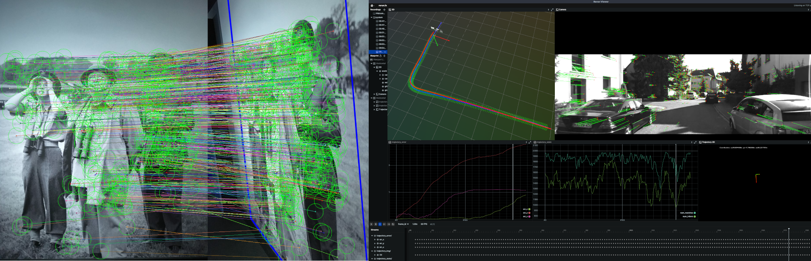

# pySLAM v2.2.5

Author: **[Luigi Freda](https://www.luigifreda.com)**

<!-- TOC -->

- [pySLAM v2.2.5](#pyslam-v225)
    - [1. Install](#1-install)
        - [1.1. Main requirements](#11-main-requirements)
        - [1.2. Ubuntu](#12-ubuntu)
        - [1.3. MacOS](#13-macos)
        - [1.4. Docker](#14-docker)
        - [1.5. How to install non-free OpenCV modules](#15-how-to-install-non-free-opencv-modules)
        - [1.6. Troubleshooting and performance issues](#16-troubleshooting-and-performance-issues)
    - [2. Usage](#2-usage)
        - [2.1. Feature tracking](#21-feature-tracking)
        - [2.2. Loop closing](#22-loop-closing)
            - [2.2.1. Vocabulary management for DBoW and VLAD](#221-vocabulary-management-for-dbow-and-vlad)
            - [2.2.2. Vocabulary-free loop closing](#222-vocabulary-free-loop-closing)
        - [2.3. Volumetric reconstruction pipeline](#23-volumetric-reconstruction-pipeline)
        - [2.4. Depth prediction](#24-depth-prediction)
        - [2.5. Save and reload a map](#25-save-and-reload-a-map)
        - [2.6. Relocalization in a loaded map](#26-relocalization-in-a-loaded-map)
        - [2.7. Trajectory saving](#27-trajectory-saving)
        - [2.8. SLAM GUI](#28-slam-gui)
        - [2.9. Monitor the logs for tracking, local mapping, and loop closing simultaneously](#29-monitor-the-logs-for-tracking-local-mapping-and-loop-closing-simultaneously)
    - [3. Supported local features](#3-supported-local-features)
    - [4. Supported matchers](#4-supported-matchers)
    - [5. Supported global descriptors and local descriptor aggregation methods](#5-supported-global-descriptors-and-local-descriptor-aggregation-methods)
            - [5.1. Local descriptor aggregation methods](#51-local-descriptor-aggregation-methods)
            - [5.2. Global descriptors](#52-global-descriptors)
    - [6. Supported depth prediction models](#6-supported-depth-prediction-models)
    - [7. Datasets](#7-datasets)
        - [7.1. KITTI Datasets](#71-kitti-datasets)
        - [7.2. TUM Datasets](#72-tum-datasets)
        - [7.3. EuRoC Dataset](#73-euroc-dataset)
    - [8. Camera Settings](#8-camera-settings)
    - [9. Comparison pySLAM vs ORB-SLAM3](#9-comparison-pyslam-vs-orb-slam3)
    - [10. Contributing to pySLAM](#10-contributing-to-pyslam)
    - [11. References](#11-references)
    - [12. Credits](#12-credits)
    - [13. TODOs](#13-todos)

<!-- /TOC -->
 
**pySLAM** is a python implementation of a *Visual SLAM* pipeline that supports **monocular**, **stereo** and **RGBD** cameras. It provides the following **features**:
- A wide range of classical and modern **[local features](#supported-local-features)** with a convenient interface for their integration.
- Various loop closing methods, including **[descriptor aggregators](#supported-global-descriptors-and-local-descriptor-aggregation-methods)** such as visual Bag of Words (BoW, iBow), Vector of Locally Aggregated Descriptors (VLAD) and modern **[global descriptors](#supported-global-descriptors-and-local-descriptor-aggregation-methods)** (image-wise descriptors).
- A **[volumetric reconstruction pipeline](#volumetric-reconstruction-pipeline)** that processes available depth and color images.
- Integration of **[depth prediction models](#depth-prediction)**, including DepthPro and DepthAnythingV2, within the SLAM pipeline.  
- A collection of other useful tools for VO and SLAM.

**Main Scripts**
* `main_vo.py` combines the simplest VO ingredients without performing any image point triangulation or windowed bundle adjustment. At each step $k$, `main_vo.py` estimates the current camera pose $C_k$ with respect to the previous one $C_{k-1}$. The inter-frame pose estimation returns $[R_{k-1,k},t_{k-1,k}]$ with $\Vert t_{k-1,k} \Vert=1$. With this very basic approach, you need to use a ground truth in order to recover a correct inter-frame scale $s$ and estimate a valid trajectory by composing $C_k = C_{k-1} [R_{k-1,k}, s t_{k-1,k}]$. This script is a first start to understand the basics of inter-frame feature tracking and camera pose estimation.

* `main_slam.py` adds feature tracking along multiple frames, point triangulation, keyframe management, bundle adjustment, loop closing, dense mapping and depth inference in order to estimate the camera trajectory and build both a sparse and dense map. It's a full SLAM pipeline and includes all the basic and advanced blocks which are necessary to develop a real visual SLAM pipeline.

* `main_feature_matching.py` shows how to use the basic feature tracker capabilities (*feature detector* + *feature descriptor* + *feature matcher*) and allows to test the different available local features. 

* `main_depth_prediction.py` shows how to use the available depth inference models to get depth estimations from input color images.
  
* `main_map_viewer.py` allows to reload a saved map and visualize it. Further details [here](#relocalization-in-a-loaded-map).

**System architecture overview**      
[Here](./docs/basic_architecture.md) you can find a couple of diagram sketches that provide an overview of the main system components, and classes relationships and dependencies.

You can use the pySLAM framework as a baseline to experiment with VO techniques, *[local features](#supported-local-features)*, *[descriptor aggregators](#supported-global-descriptors-and-local-descriptor-aggregation-methods)*, *[global descriptors](#supported-global-descriptors-and-local-descriptor-aggregation-methods)*, *[volumetric integration](#volumetric-reconstruction-pipeline)*, *[depth prediction](#depth-prediction)*, and create your own (proof of concept) VO/SLAM pipeline in python. When working with it, please keep in mind this is a research framework written in Python and a work in progress. It is not designed for real-time performances.   

**Enjoy it!**

<p align="center" style="margin:0">
   
 
 
  
 
</p>

--- 
## Install 

First, clone this repo and its modules by running 
```bash
$ git clone --recursive https://github.com/luigifreda/pyslam.git
$ cd pyslam 
```

Then, use the available specific install procedure according to your OS. The provided scripts will create a **single python environment** that is able to host all the [supported local features](#supported-local-features)!

- **Ubuntu**  [=>](#ubuntu)
- **MacOs** [=>](#macos) 
- **Windows** [=>](https://github.com/luigifreda/pyslam/issues/51)
- **Docker** [=>](#docker)


### Main requirements

* Python 3.8.10
* OpenCV >=4.10 (see [below](#how-to-install-non-free-opencv-modules))
* PyTorch 2.3.1
* Tensorflow 2.13.1
* Kornia 0.7.3
* Rerun

If you encounter any issues or performance problems, refer to the [TROUBLESHOOTING](./TROUBLESHOOTING.md) file for assistance.


### Ubuntu 

Follow the instructions reported [here](./PYTHON-VIRTUAL-ENVS.md) for creating a new virtual environment `pyslam` with **venv**.  The procedure has been tested on *Ubuntu 18.04*, *20.04*, *22.04* and *24.04*. 

If you prefer **conda**, run the scripts described in this other [file](./CONDA.md).


### MacOS

Follow the instructions in this [file](./MAC.md). The reported procedure was tested under *Sequoia 15.1.1* and *Xcode 16.1*.


### Docker

If you prefer docker or you have an OS that is not supported yet, you can use [rosdocker](https://github.com/luigifreda/rosdocker): 
- with its custom `pyslam` / `pyslam_cuda` docker files and follow the instructions [here](https://github.com/luigifreda/rosdocker#pyslam). 
- with one of the suggested docker images (*ubuntu\*_cuda* or *ubuntu\**), where you can build and run pyslam. 


### How to install non-free OpenCV modules

The provided install scripts will install a recent opencv version (>=**4.10**) with non-free modules enabled (see the provided scripts [install_pip3_packages.sh](./install_pip3_packages.sh) and [install_opencv_python.sh](./install_opencv_python.sh)). To quickly verify your installed opencv version run:       
`$ . pyenv-activate.sh `        
`$ ./opencv_check.py`       
or use the following command:        
`$ python3 -c "import cv2; print(cv2.__version__)"`      
How to check if you have non-free OpenCV module support (no errors imply success):          
`$ python3 -c "import cv2; detector = cv2.xfeatures2d.SURF_create()"`    


### Troubleshooting and performance issues

If you run into issues or errors during the installation process or at run-time, please, check the [TROUBLESHOOTING.md](./TROUBLESHOOTING.md) file.

--- 
## Usage

Once you have run the script `install_all_venv.sh` (follow the instructions above according to your OS), you can open a new terminal and run:
```bash
$ . pyenv-activate.sh   #  Activate pyslam python virtual environment. This is only needed once in a new terminal.
$ ./main_vo.py
```
This will process a default [KITTI](http://www.cvlibs.net/datasets/kitti/eval_odometry.php) video (available in the folder `videos`) by using its corresponding camera calibration file (available in the folder `settings`), and its groundtruth (available in the same `videos` folder). If matplotlib windows are used, you can stop `main_vo.py` by focusing/clicking on one of them and pressing the key 'Q'. 
**Note**: As explained above, the basic script `main_vo.py` **strictly requires a ground truth**.  

In order to process a different **dataset**, you need to set the file `config.yaml`:
* Select your dataset `type` in the section `DATASET` (further details in the section *[Datasets](#datasets)* below for further details). This identifies a corresponding dataset section (e.g. `KITTI_DATASET`, `TUM_DATASET`, etc). 
* Select the `sensor_type` (`mono`, `stereo`, `rgbd`) in the chosen dataset section.  
* Select the camera `settings` file in the dataset section (further details in the section *[Camera Settings](#camera-settings)* below).
* The `groudtruth_file` accordingly (further details in the section *[Datasets](#datasets)* below and check the files `ground_truth.py` and `convert_groundtruth.py`).

Similarly, you can test `main_slam.py` by running:
```bash
$ . pyenv-activate.sh   #  Activate pyslam python virtual environment. This is only needed once in a new terminal.
$ ./main_slam.py
```

This will process a default [KITTI]((http://www.cvlibs.net/datasets/kitti/eval_odometry.php)) video (available in the folder `videos`) by using its corresponding camera calibration file (available in the folder `settings`). You can stop it by focusing/clicking on one of the opened matplotlib windows and pressing the key 'Q'. 
**Note**: Due to information loss in video compression, `main_slam.py` tracking may peform worse with the available KITTI videos than with the original KITTI image sequences. The available videos are intended to be used for a first quick test. Please, download and use the original KITTI image sequences as explained [below](#datasets).

### Feature tracking

If you just want to test the basic feature tracking capabilities (*feature detector* + *feature descriptor* + *feature matcher*) and get a taste of the different available local features, run
```bash
$ . pyenv-activate.sh   #  Activate pyslam python virtual environment. This is only needed once in a new terminal.
$ ./main_feature_matching.py
```

In any of the above scripts, you can choose any detector/descriptor among *ORB*, *SIFT*, *SURF*, *BRISK*, *AKAZE*, *SuperPoint*, etc. (see the section *[Supported Local Features](#supported-local-features)* below for further information). 

Some basic examples are available in the subfolder `test/loopclosing`. In particular, as for feature detection/description, you may want to take a look at [test/cv/test_feature_manager.py](./test/cv/test_feature_manager.py) too.

### Loop closing

Different [loop closing methods](#loop-closing) are available, combining [aggregation methods](#local-descriptor-aggregation-methods) and [global descriptors](#global-descriptors).
Loop closing is enabled by default and can be disabled by setting `kUseLoopClosing=False` in `parameters.py`. Configuration options can be found in [loop_detector_configs.py](loop_detector_configs.py).

**Examples**: Start with the examples in `test/loopclosing`, such as [test/loopclosing/test_loop_detector.py](./test/loopclosing/test_loop_detector.py).


#### Vocabulary management for DBoW and VLAD

- **Generate descriptors array**: Use `test/loopclosing/test_gen_des_array_from_imgs.py` to generate the array of descriptors for training a vocabulary. Select your desired descriptor type via the tracker configuration. 

- **DBOW vocabulary generation**: Train your target vocabulary by using the script `test/loopclosing/test_gen_dbow_voc_from_des_array.py`.

- **VLAD vocabulary generation**: Train your target VLAD "vocabulary" by using the script `test/loopclosing/test_gen_vlad_voc_from_des_array.py`.

#### Vocabulary-free loop closing

Most methods do not require pre-trained vocabularies. Specifically:
- `iBoW` and `OBindex2`: These methods incrementally build bags of binary words and, if needed, convert (front-end) non-binary descriptors into binary ones. 
- Others: Methods like HDC_DELF, SAD, AlexNet, NetVLAD, CosPlace, and EigenPlaces directly extract global descriptors and process them using dedicated aggregators.

Only DBoW2, DBoW3, and VLAD require pre-trained vocabularies.

### Volumetric reconstruction pipeline

The volumetric reconstruction pipeline is disabled by default. You can enable it by setting `kUseVolumetricIntegration=True` in `parameters.py`. This runs in the back-end. At present, it works with RGBD datasets or when a depth image is available at each frame. 

If you want a mesh as output set `kVolumetricIntegrationExtractMesh=True` in `parameters.py`.
   
### Depth prediction

The available depth prediction models can be utilized both in the SLAM back-end and front-end. 
- Back-end: Depth prediction can be enabled in the volumetric reconstruction pipeline by setting the parameter `kVolumetricIntegrationUseDepthEstimator` in `parameters.py`. 
- Front-end: Depth prediction can be enabled in the front-end by setting the parameter `kUseDepthEstimatorInFrontEnd` in `parameters.py`. This feature estimates depth images from input color images to emulate a RGBD camera. Please, note this functionality is still very *experimental* at present time [WIP].   

Refer to the file `depth_estimator.py` for further details. You can test it by using the script `main_depth_prediction.py`.

**Notes**: 
* In the case of a monocular SLAM configuration, do NOT use depth prediction in the back-end: The SLAM (fake) scale will conflict with the absolute metric scale of depth predictions. In such a configuration, enable depth prediction in the front-end.
- The depth inference is very slow (with DepthPro it takes ~1s per image on my machine). Therefore, the resulting volumetric reconstruction pipeline is very slow.

### Save and reload a map

When you run the script `main_slam.py`:
- The current map can be saved into the file `data/slam_state/map.json` by pressing the button `Save` on the GUI. 
- The saved map can be reloaded and visualized into the GUI by running: 
  ```bash
  $ . pyenv-activate.sh   #  Activate pyslam python virtual environment. This is only needed once in a new terminal.
  $ ./main_map_viewer.py
  ```

### Relocalization in a loaded map 

To enable map reloading and relocalization in it, open `config.yaml` and set 
```bash
SYSTEM_STATE:
  load_state: True               # flag to enable SLAM state reloading (map state + loop closing state)
  folder_path: data/slam_state   # folder path relative to root of this repository
```

Pressing the `Save` button saves the current map, front-end, and backend configurations. Reloading a saved map overwrites the current system configurations to ensure descriptor compatibility.  


### Trajectory saving

Estimated trajectories can be saved in three different formats: *TUM* (The Open Mapping format), *KITTI* (KITTI Odometry format), and *EuRoC* (EuRoC MAV format). To enable trajectory saving, open `config.yaml` and search for the `SAVE_TRAJECTORY`: set `save_trajectory: True`, select your `format_type` (`tum`, `kitti`, `euroc`), and the output filename. For instance for a `tum` format output:   
```bash
SAVE_TRAJECTORY:
  save_trajectory: True
  format_type: tum
  filename: kitti00_trajectory.txt
```

### SLAM GUI 

Some quick information about the non-trivial GUI buttons of `main_slam.py`: 
- `Step`: Enter in the *Step by step mode*. Press the button `Step` a first time to pause. Then, press it again to make the pipeline process a single new frame.
- `Save`: Save the map into the file `map.json`. You can visualize it back by using the script `/main_map_viewer.py` (as explained above). 
- `Reset`: Reset SLAM system. 
- `Draw Grount Truth`: In the case a groundtruth is loaded (e.g. with *KITTI*, *TUM*, *EUROC* datasets), you can visualize it by pressing this button. The groundtruth trajectory will be visualized and progressively aligned to the estimated trajectory: The more the number of samples in the estimated trajectory the better the computed alignment.  


### Monitor the logs for tracking, local mapping, and loop closing simultaneously

The logs generated by the modules `local_mapping.py`, `loop_closing.py`, `loop_detecting_process.py`, and `global_bundle_adjustments.py` are collected in the files `local_mapping.log`, `loop_closing.log`, `loop_detecting.log`, and `gba.log`, which are all stored in the folder `logs`. For fun/debugging, you can monitor each parallel flow by running the following command in a separate shell:    
`$ tail -f logs/<log file name>`     
Otherwise, just run the script:       
`$ ./scripts/launch_tmux_slam.sh`      
from the repo root folder. Press `CTRL+A` and then `CTRL+Q` to exit from `tmux` environment.

---
## Supported local features

At present time, the following feature **detectors** are supported: 
* *[FAST](https://www.edwardrosten.com/work/fast.html)*  
* *[Good features to track](https://ieeexplore.ieee.org/document/323794)* 
* *[ORB](http://www.willowgarage.com/sites/default/files/orb_final.pdf)*  
* *[ORB2](https://github.com/raulmur/ORB_SLAM2)* (improvements of ORB-SLAM2 to ORB detector) 
* *[SIFT](https://www.cs.ubc.ca/~lowe/papers/iccv99.pdf)*   
* *[SURF](http://people.ee.ethz.ch/~surf/eccv06.pdf)*   
* *[KAZE](https://www.doc.ic.ac.uk/~ajd/Publications/alcantarilla_etal_eccv2012.pdf)*
* *[AKAZE](http://www.bmva.org/bmvc/2013/Papers/paper0013/paper0013.pdf)* 
* *[BRISK](http://www.margaritachli.com/papers/ICCV2011paper.pdf)*  
* *[AGAST](http://www.i6.in.tum.de/Main/ResearchAgast)*
* *[MSER](http://cmp.felk.cvut.cz/~matas/papers/matas-bmvc02.pdf)*
* *[StarDector/CenSurE](https://link.springer.com/content/pdf/10.1007%2F978-3-540-88693-8_8.pdf)*
* *[Harris-Laplace](https://www.robots.ox.ac.uk/~vgg/research/affine/det_eval_files/mikolajczyk_ijcv2004.pdf)* 
* *[SuperPoint](https://github.com/MagicLeapResearch/SuperPointPretrainedNetwork)*
* *[D2-Net](https://github.com/mihaidusmanu/d2-net)*
* *[DELF](https://github.com/tensorflow/models/tree/master/research/delf)*
* *[Contextdesc](https://github.com/lzx551402/contextdesc)*
* *[LFNet](https://github.com/vcg-uvic/lf-net-release)*
* *[R2D2](https://github.com/naver/r2d2)*
* *[Key.Net](https://github.com/axelBarroso/Key.Net)*
* *[DISK](https://arxiv.org/abs/2006.13566)*
* *[ALIKED](https://arxiv.org/abs/2304.03608)*
* *[Xfeat](https://arxiv.org/abs/2404.19174)*
* *[KeyNetAffNetHardNet](https://github.com/axelBarroso/Key.Net)* (KeyNet detector + AffNet + HardNet descriptor).

The following feature **descriptors** are supported: 
* *[ORB](http://www.willowgarage.com/sites/default/files/orb_final.pdf)*  
* *[SIFT](https://www.cs.ubc.ca/~lowe/papers/iccv99.pdf)*
* *[ROOT SIFT](https://www.robots.ox.ac.uk/~vgg/publications/2012/Arandjelovic12/arandjelovic12.pdf)*
* *[SURF](http://people.ee.ethz.ch/~surf/eccv06.pdf)*    
* *[AKAZE](http://www.bmva.org/bmvc/2013/Papers/paper0013/paper0013.pdf)* 
* *[BRISK](http://www.margaritachli.com/papers/ICCV2011paper.pdf)*     
* *[FREAK](https://www.researchgate.net/publication/258848394_FREAK_Fast_retina_keypoint)* 
* *[SuperPoint](https://github.com/MagicLeapResearch/SuperPointPretrainedNetwork)*
* *[Tfeat](https://github.com/vbalnt/tfeat)*
* *[BOOST_DESC](https://www.labri.fr/perso/vlepetit/pubs/trzcinski_pami15.pdf)*
* *[DAISY](https://ieeexplore.ieee.org/document/4815264)*
* *[LATCH](https://arxiv.org/abs/1501.03719)*
* *[LUCID](https://pdfs.semanticscholar.org/85bd/560cdcbd4f3c24a43678284f485eb2d712d7.pdf)*
* *[VGG](https://www.robots.ox.ac.uk/~vedaldi/assets/pubs/simonyan14learning.pdf)*
* *[Hardnet](https://github.com/DagnyT/hardnet.git)*
* *[GeoDesc](https://github.com/lzx551402/geodesc.git)*
* *[SOSNet](https://github.com/yuruntian/SOSNet.git)*
* *[L2Net](https://github.com/yuruntian/L2-Net)*
* *[Log-polar descriptor](https://github.com/cvlab-epfl/log-polar-descriptors)*
* *[D2-Net](https://github.com/mihaidusmanu/d2-net)*
* *[DELF](https://github.com/tensorflow/models/tree/master/research/delf)*
* *[Contextdesc](https://github.com/lzx551402/contextdesc)*
* *[LFNet](https://github.com/vcg-uvic/lf-net-release)*
* *[R2D2](https://github.com/naver/r2d2)*
* *[BEBLID](https://raw.githubusercontent.com/iago-suarez/BEBLID/master/BEBLID_Boosted_Efficient_Binary_Local_Image_Descriptor.pdf)*
* *[DISK](https://arxiv.org/abs/2006.13566)*
* *[ALIKED](https://arxiv.org/abs/2304.03608)*
* *[Xfeat](https://arxiv.org/abs/2404.19174)*
* *[KeyNetAffNetHardNet](https://github.com/axelBarroso/Key.Net)* (KeyNet detector + AffNet + HardNet descriptor).
  
For more information, refer to [feature_types.py](./feature_types.py) file. Some of the local features consist of a *joint detector-descriptor*. You can start playing with the supported local features by taking a look at `test/cv/test_feature_manager.py` and `main_feature_matching.py`.

In both the scripts `main_vo.py` and `main_slam.py`, you can create your preferred detector-descritor configuration and feed it to the function `feature_tracker_factory()`. Some ready-to-use configurations are already available in the file [feature_tracker.configs.py](./feature_tracker_configs.py)

The function `feature_tracker_factory()` can be found in the file `feature_tracker.py`. Take a look at the file `feature_manager.py` for further details.

**N.B.**: you just need a *single* python environment to be able to work with all the [supported local features](#supported-local-features)!

---
## Supported matchers 

* *BF*: Brute force matcher on descriptors (with KNN).
* *[FLANN](https://www.semanticscholar.org/paper/Fast-Approximate-Nearest-Neighbors-with-Automatic-Muja-Lowe/35d81066cb1369acf4b6c5117fcbb862be2af350)* 
* *[XFeat](https://arxiv.org/abs/2404.19174)*      
* *[LightGlue](https://arxiv.org/abs/2306.13643)*
* *[LoFTR](https://arxiv.org/abs/2104.00680)*
  
See the file `feature_matcher.py` for further details.

---
## Supported global descriptors and local descriptor aggregation methods


#### Local descriptor aggregation methods

* Bag of Words (BoW): [DBoW2](https://github.com/dorian3d/DBoW2), [DBoW3](https://github.com/rmsalinas/DBow3).  [[paper](https://doi.org/10.1109/TRO.2012.2197158)]
* Vector of Locally Aggregated Descriptors: [VLAD](https://www.vlfeat.org/api/vlad.html).  [[paper](https://doi.org/10.1109/CVPR.2010.5540039)] 
* Incremental Bags of Binary Words (iBoW) via Online Binary Image Index: [iBoW](https://github.com/emiliofidalgo/ibow-lcd), [OBIndex2](https://github.com/emiliofidalgo/obindex2).  [[paper](https://doi.org/10.1109/LRA.2018.2849609)]
* Hyperdimensional Computing: [HDC](https://www.tu-chemnitz.de/etit/proaut/hdc_desc).  [[paper](https://openaccess.thecvf.com/content/CVPR2021/html/Neubert_Hyperdimensional_Computing_as_a_Framework_for_Systematic_Aggregation_of_Image_CVPR_2021_paper.html)]


**NOTE**: *iBoW* and *OBIndex2* incrementally build a binary image index and do not need a prebuilt vocabulary. In the implemented classes, when needed, the input non-binary local descriptors are transparently transformed into binary descriptors.

#### Global descriptors

Also referred to as *holistic descriptors*:

* [SAD](https://ieeexplore.ieee.org/document/6224623)
* [AlexNet](https://github.com/BVLC/caffe/tree/master/models/bvlc_alexnet)
* [NetVLAD](https://www.di.ens.fr/willow/research/netvlad/)
* [HDC-DELF](https://www.tu-chemnitz.de/etit/proaut/hdc_desc)
* [CosPlace](https://github.com/gmberton/CosPlace)
* [EigenPlaces](https://github.com/gmberton/EigenPlaces)


Different [loop closing methods](#loop-closing) are available. These combines the above aggregation methods and global descriptors.
See the file [loop_detector_configs.py](loop_detector_configs.py) for further details.

---
## Supported depth prediction models

* [Depth-Pro](https://arxiv.org/abs/2410.02073)
* [DepthAnythingV2](https://arxiv.org/abs/2406.09414)

--- 
## Datasets

Five different types of datasets are available:

Dataset | type in `config.yaml`
--- | --- 
[KITTI odometry data set (grayscale, 22 GB)](http://www.cvlibs.net/datasets/kitti/eval_odometry.php)  | `type: KITTI_DATASET` 
[TUM dataset](https://vision.in.tum.de/data/datasets/rgbd-dataset/download)                   | `type: TUM_DATASET` 
[EUROC dataset](http://projects.asl.ethz.ch/datasets/doku.php?id=kmavvisualinertialdatasets)                   | `type: EUROC_DATASET` 
Video file        | `type: VIDEO_DATASET` 
Folder of images  | `type: FOLDER_DATASET` 

### KITTI Datasets

pySLAM code expects the following structure in the specified KITTI path folder (specified in the section `KITTI_DATASET` of the file `config.yaml`). : 
```
├── sequences
    ├── 00
    ...
    ├── 21
├── poses
    ├── 00.txt
        ...
    ├── 10.txt

```
1. Download the dataset (grayscale images) from http://www.cvlibs.net/datasets/kitti/eval_odometry.php and prepare the KITTI folder as specified above

2. Select the corresponding calibration settings file (parameter `[KITTI_DATASET][cam_settings]` in the file `config.yaml`)


### TUM Datasets 

pySLAM code expects a file `associations.txt` in each TUM dataset folder (specified in the section `TUM_DATASET:` of the file `config.yaml`). 

1. Download a sequence from http://vision.in.tum.de/data/datasets/rgbd-dataset/download and uncompress it.
2. Associate RGB images and depth images using the python script [associate.py](http://vision.in.tum.de/data/datasets/rgbd-dataset/tools). You can generate your `associations.txt` file by executing:
```bash
$ python associate.py PATH_TO_SEQUENCE/rgb.txt PATH_TO_SEQUENCE/depth.txt > associations.txt
```
3. Select the corresponding calibration settings file (parameter `TUM_DATASET: cam_settings:` in the file `config.yaml`).


### EuRoC Dataset

1. Download a sequence (ASL format) from http://projects.asl.ethz.ch/datasets/doku.php?id=kmavvisualinertialdatasets (check this direct [link](http://robotics.ethz.ch/~asl-datasets/ijrr_euroc_mav_dataset/))
2. Use the script `groundtruth/generate_euroc_groundtruths_as_tum.sh` to generate the TUM-like groundtruth files `path + '/' + name + '/mav0/state_groundtruth_estimate0/data.tum'` that are required by the `EurocGroundTruth` class.
3. Select the corresponding calibration settings file (parameter `EUROC_DATASET: cam_settings:` in the file `config.yaml`).

--- 
## Camera Settings

The folder `settings` contains the camera settings files which can be used for testing the code. These are the same used in the framework [ORB-SLAM2](https://github.com/raulmur/ORB_SLAM2). You can easily modify one of those files for creating your own new calibration file (for your new datasets).

In order to calibrate your camera, you can use the scripts in the folder `calibration`. In particular: 
1. use the script `grab_chessboard_images.py` to collect a sequence of images where the chessboard can be detected (set the chessboard size therein, you can use the calibration pattern `calib_pattern.pdf` in the same folder) 
2. use the script `calibrate.py` to process the collected images and compute the calibration parameters (set the chessboard size therein)

For more information on the calibration process, see this [tutorial](https://learnopencv.com/camera-calibration-using-opencv/) or this other [link](https://docs.opencv.org/4.x/dc/dbb/tutorial_py_calibration.html). 

If you want to **use your camera**, you have to:
* calibrate it and configure [WEBCAM.yaml](./settings/WEBCAM.yaml) accordingly
* record a video (for instance, by using `save_video.py` in the folder `calibration`)
* configure the `VIDEO_DATASET` section of `config.yaml` in order to point to your recorded video.

--- 
## Comparison pySLAM vs ORB-SLAM3

For a comparison of the trajectories estimated by pySLAM and by ORB-SLAM3, see this [trajectory comparison notebook](https://github.com/anathonic/Trajectory-Comparison-ORB-SLAM3-pySLAM/blob/main/trajectories_comparison.ipynb). 

Note that pySLAM saves its pose estimates in an **online** fashion: At each frame, the current pose estimate is saved at the end of the front-end `tracking` iteration. On the other end, ORB-SLAM3 pose estimates are saved at the end of the full dataset playback: That means each pose estimate $q$ of ORB-SLAM is refined multiple times by LBA and BA over the multiple window optimizations that cover $q$.  

You can save your pyslam trajectories as detailed [here](#trajectory-saving).

--- 
## Contributing to pySLAM

If you like pySLAM and would like to contribute to the code base, you can report bugs, leave comments and proposing new features through issues and pull requests on github. Feel free to get in touch at *luigifreda(at)gmail[dot]com*. Thank you!

--- 
## References

Suggested books:
* *[Multiple View Geometry in Computer Vision](https://www.robots.ox.ac.uk/~vgg/hzbook/)* by Richard Hartley and Andrew Zisserman
* *[An Invitation to 3-D Vision](https://link.springer.com/book/10.1007/978-0-387-21779-6)* by Yi-Ma, Stefano Soatto, Jana Kosecka, S. Shankar Sastry 
* *[Computer Vision: Algorithms and Applications](http://szeliski.org/Book/)*, by Richard Szeliski 
* *[Deep Learning](http://www.deeplearningbook.org/lecture_slides.html)*, by Ian Goodfellow, Yoshua Bengio and Aaron Courville
* *[Neural Networks and Deep Learning](http://neuralnetworksanddeeplearning.com/index.html)*, By Michael Nielsen 

Suggested material:
* *[Vision Algorithms for Mobile Robotics](http://rpg.ifi.uzh.ch/teaching.html)* by Davide Scaramuzza 
* *[CS 682 Computer Vision](http://cs.gmu.edu/~kosecka/cs682.html)* by Jana Kosecka   
* *[ORB-SLAM: a Versatile and Accurate Monocular SLAM System](http://webdiis.unizar.es/~raulmur/MurMontielTardosTRO15.pdf)* by R. Mur-Artal, J. M. M. Montiel, and J. D. Tardos
* *[Double Window Optimisation for Constant Time Visual SLAM](http://hauke.strasdat.net/files/strasdat2011iccv.pdf)* by H. Strasdat, A. J. Davison, J.M.M. Montiel, K. Konolige
* *[The Role of Wide Baseline Stereo in the Deep Learning World](https://ducha-aiki.github.io/wide-baseline-stereo-blog/2020/03/27/intro.html)* by Dmytro Mishkin
* *[To Learn or Not to Learn: Visual Localization from Essential Matrices](https://arxiv.org/abs/1908.01293)* by Qunjie Zhou, Torsten Sattler, Marc Pollefeys, Laura Leal-Taixe
* *[Awesome local-global descriptors](https://github.com/shamangary/awesome-local-global-descriptor)* repository 
* *[Introduction to Feature Matching Using Neural Networks](https://learnopencv.com/feature-matching/)*
* *[Visual Place Recognition: A Tutorial](https://arxiv.org/pdf/2303.03281)*
* *[Bags of Binary Words for Fast Place Recognition in Image Sequences](http://doriangalvez.com/papers/GalvezTRO12.pdf)*

Moreover, you may want to have a look at the OpenCV [guide](https://docs.opencv.org/3.0-beta/modules/calib3d/doc/camera_calibration_and_3d_reconstruction.html) or [tutorials](https://opencv-python-tutroals.readthedocs.io/en/latest/py_tutorials/py_tutorials.html).  

---
## Credits 

* [Pangolin](https://github.com/stevenlovegrove/Pangolin) 
* [g2opy](https://github.com/uoip/g2opy)
* [ORBSLAM2](https://github.com/raulmur/ORB_SLAM2)
* [SuperPointPretrainedNetwork](https://github.com/MagicLeapResearch/SuperPointPretrainedNetwork)
* [Tfeat](https://github.com/vbalnt/tfeat)
* [Image Matching Benchmark Baselines](https://github.com/vcg-uvic/image-matching-benchmark-baselines)
* [Hardnet](https://github.com/DagnyT/hardnet.git)
* [GeoDesc](https://github.com/lzx551402/geodesc.git)
* [SOSNet](https://github.com/yuruntian/SOSNet.git)
* [L2Net](https://github.com/yuruntian/L2-Net)
* [Log-polar descriptor](https://github.com/cvlab-epfl/log-polar-descriptors)
* [D2-Net](https://github.com/mihaidusmanu/d2-net)
* [DELF](https://github.com/tensorflow/models/blob/master/research/delf/INSTALL_INSTRUCTIONS.md)
* [Contextdesc](https://github.com/lzx551402/contextdesc)
* [LFNet](https://github.com/vcg-uvic/lf-net-release)
* [R2D2](https://github.com/naver/r2d2)
* [BEBLID](https://raw.githubusercontent.com/iago-suarez/BEBLID/master/BEBLID_Boosted_Efficient_Binary_Local_Image_Descriptor.pdf)
* [DISK](https://arxiv.org/abs/2006.13566)
* [Xfeat](https://arxiv.org/abs/2404.19174)
* [LightGlue](https://arxiv.org/abs/2306.13643)
* [Key.Net](https://github.com/axelBarroso/Key.Net)
* [Twitchslam](https://github.com/geohot/twitchslam)
* [MonoVO](https://github.com/uoip/monoVO-python)
* [VPR_Tutorial](https://github.com/stschubert/VPR_Tutorial.git)
* [DepthAnythingV2](https://github.com/DepthAnything/Depth-Anything-V2)
* [DepthPro](https://github.com/apple/ml-depth-pro)
* Many thanks to [Anathonic](https://github.com/anathonic) for adding the trajectory-saving feature and for the comparison notebook: [pySLAM vs ORB-SLAM3](https://github.com/anathonic/Trajectory-Comparison-ORB-SLAM3-pySLAM/blob/main/trajectories_comparison.ipynb).

---
## TODOs

Many improvements and additional features are currently under development: 

- [x] loop closing
- [x] relocalization 
- [x] stereo and RGBD support
- [x] map saving/loading 
- [x] modern DL matching algorithms 
- [ ] object detection and semantic segmentation 
- [x] 3D dense reconstruction 
- [x] unified install procedure (single branch) for all OSs 
- [x] trajectory saving 
- [x] depth prediction integration
- [ ] ROS support

