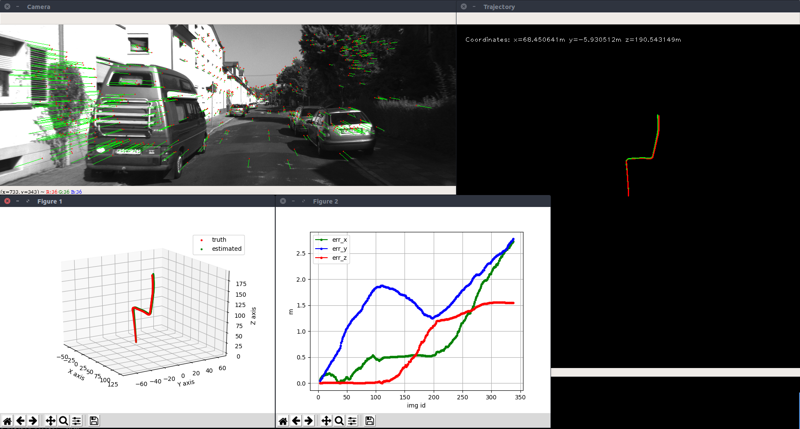
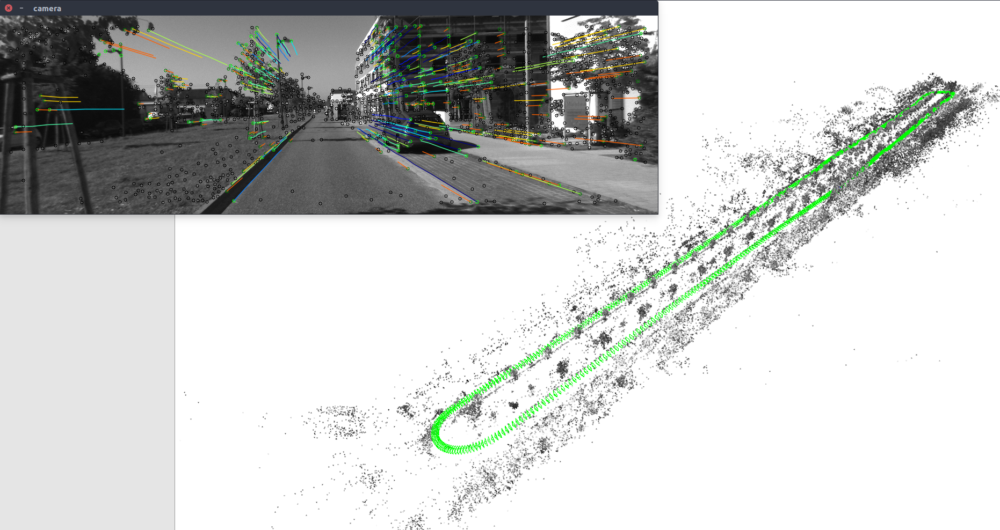
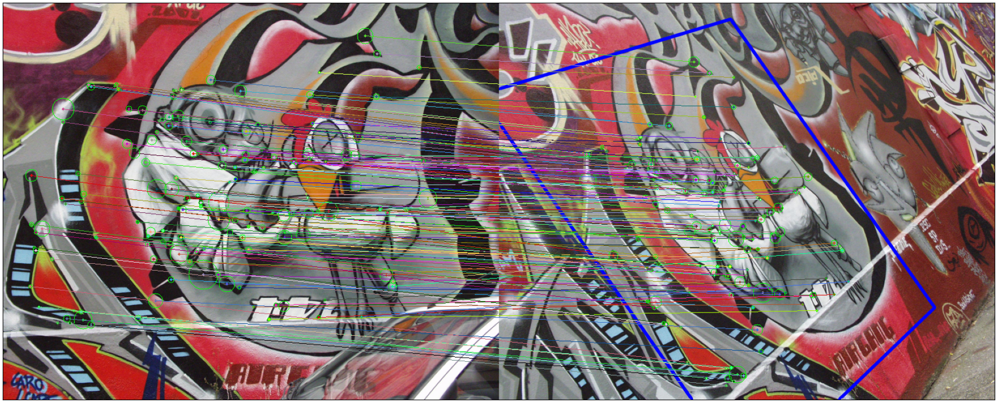

# pySLAM v2 

Author: [Luigi Freda](https://www.luigifreda.com)

**pySLAM** contains a python implementation of a monocular *Visual Odometry (VO)* pipeline. It supports many classical and modern **[local features](#detectorsdescriptors)**, and it offers a convenient interface for them. Moreover, it collects other common and useful VO and SLAM tools.

I released pySLAM v1 for educational purposes, for a [computer vision class](https://as-ai.org/visual-perception-and-spatial-computing/) I taught. I started developing it for fun as a python programming exercise, during my free time, taking inspiration from some repos available on the web. 

Main Scripts:
* `main_vo.py` combines the simplest VO ingredients without performing any image point triangulation or windowed bundle adjustment. At each step $k$, `main_vo.py` estimates the current camera pose $C_k$ with respect to the previous one $C_{k-1}$. The inter-frame pose estimation returns $[R_{k-1,k},t_{k-1,k}]$ with $||t_{k-1,k}||=1$. With this very basic approach, you need to use a ground truth in order to recover a correct inter-frame scale $s$ and estimate a valid trajectory by composing $C_k = C_{k-1} * [R_{k-1,k}, s t_{k-1,k}]$. This script is a first start to understand the basics of inter-frame feature tracking and camera pose estimation.

* `main_slam.py` adds feature tracking along multiple frames, point triangulation, keyframe management and bundle adjustment in order to estimate the camera trajectory up-to-scale and build a map. It's still a VO pipeline but it shows some basic blocks which are necessary to develop a real visual SLAM pipeline. 

You can use this framework as a baseline to play with [local features](#detectorsdescriptors), VO techniques and create your own (proof of concept) VO/SLAM pipeline in python. When you test it, consider that's a work in progress, a development framework written in Python, without any pretence of having state-of-the-art localization accuracy or real-time performances.   

**Enjoy it!**

<center>  

  </center>

--- 
## Install 

Clone this repo and its modules by running 
```
$ git clone --recursive https://github.com/luigifreda/pyslam.git
```

The framework has been developed and tested under Ubuntu 18.04. 

#### Install pySLAM in Your Working Python Environment

If you want to launch `main_vo.py`, run the script:   

`$ ./install_basic.sh`   

in order to automatically install the basic required system and python3 packages. Here, pip3 is used. 

If you want to run `main_slam.py`, you must additionally install the libs [pangolin](https://github.com/stevenlovegrove/Pangolin), [g2opy](https://github.com/uoip/g2opy), etc. by running:    

`$ ./install_all.sh`   

**Requirements**:

* Python 3  (tested under Python 3.6)
* Numpy (1.18.2)
* OpenCV (see [below](#how-to-install-non-free-opencv-modules) for a suggested python installation)
* PyTorch (>= 1.4.0)
* Tensorflow-gpu 1.14.0

#### Install pySLAM in a Custom Python Virtual Environment 

If you do not want to mess up your working python environment, you can create a new virtual environment `pyslam` by easily launching the scripts described [here](./PYTHON-VIRTUAL-ENVS.md).

If you prefer **conda**, run the scripts described in this other [file](./CONDA.md).

**N.B.**: you just need a *single* python environment to be able to work with all the [supported local features](#detectorsdescriptors)!

#### Install pySLAM on macOS 

Check the instructions in this [file](./MAC.md).

#### How to install non-free OpenCV modules

In order to use [non-free OpenCV features](https://stackoverflow.com/questions/50467696/pycharm-installation-of-non-free-opencv-modules-for-operations-like-sift-surf) (i.e. **SIFT**, **SURF**, etc.), you need to install the module `opencv-contrib-python`. The script `install_pip3_packages.sh` takes care of installing the proper version. This module can be installed by running     
```
$ pip3 uninstall opencv-contrib-python
$ pip3 install opencv-contrib-python==3.4.2.16
```

How to check your installed OpenCV version:
```
$ python3 -c "import cv2; print(cv2.__version__)"
```
For a more advanced OpenCV installation procedure, you can take a look [here](https://www.pyimagesearch.com/opencv-tutorials-resources-guides/). 

#### Issues and Errors

If you run into issues or errors during the installation process or at run-time, please, check the file [TROUBLESHOOTING.md](./TROUBLESHOOTING.md).

--- 
## Usage

Once you have run the script `install_basic.sh`, you can immediately run:
```
$ python3 -O main_vo.py
```
This will process a [KITTI]((http://www.cvlibs.net/datasets/kitti/eval_odometry.php)) video (available in the folder `videos`) by using its corresponding camera calibration file (available in the folder `settings`), and its groundtruth (available in the same `videos` folder). You can stop `main_vo.py` by focusing on the *Trajectory* window and pressing the key 'Q'. 

**N.B.**: as explained above, the basic script `main_vo.py` **strictly requires a ground truth**.  

In order to process a different **dataset**, you need to set the file `config.ini`:
* select your dataset `type` in the section `[DATASET]` (see the section *[Datasets](#datasets)* below for further details) 
* the camera settings file accordingly (see the section *[Camera Settings](#camera-settings)* below)
* the groudtruth file accordingly (ee the section *[Datasets](#datasets)* below and check the files `ground_truth.py` and `convert_groundtruth.py` )

Once you have run the script `install_all.sh` (as required [above](#requirements)), you can test  `main_slam.py` by running:
```
$ python3 -O main_slam.py
```

This will process a [KITTI]((http://www.cvlibs.net/datasets/kitti/eval_odometry.php)) video (available in the folder `videos`) by using its corresponding camera calibration file (available in the folder `settings`). You can stop it by focusing on the opened *Figure 1* window and pressing the key 'Q'. 

You can choose any detector/descriptor among *ORB*, *SIFT*, *SURF*, *BRISK*, *AKAZE*, *SuperPoint*, etc. (see the section *[Supported Local Features](#detectorsdescriptors)* below for further information). 

Some basic **test/example files** are available in the subfolder `test`. In particular, as for feature detection/description/matching, you can start by taking a look at [test/cv/test_feature_manager.py](https://github.com/luigifreda/pyslam/blob/master/test/cv/test_feature_manager.py) and [test/cv/test_feature_matching.py](https://github.com/luigifreda/pyslam/blob/master/test/cv/test_feature_matching.py).

**N.B.:**: due to information loss in video compression, `main_slam.py` tracking may peform worse with the available **KITTI videos** than with the original KITTI *image sequences*. The available videos are intended to be used for a first quick test. Please, download and use the original KITTI image sequences as explained [below](#datasets). 


---
## <a name="detectorsdescriptors"></a> Supported Local Features

At present time, the following feature **detectors** are supported: 
* *[FAST](https://www.edwardrosten.com/work/fast.html)*  
* *[Good features to track](https://ieeexplore.ieee.org/document/323794)* 
* *[ORB](http://www.willowgarage.com/sites/default/files/orb_final.pdf)*  
* *[ORB2](https://github.com/raulmur/ORB_SLAM2)* (improvements of ORB-SLAM2 to ORB detector) 
* *[SIFT](https://www.cs.ubc.ca/~lowe/papers/iccv99.pdf)*   
* *[SURF](http://people.ee.ethz.ch/~surf/eccv06.pdf)*   
* *[KAZE](https://www.doc.ic.ac.uk/~ajd/Publications/alcantarilla_etal_eccv2012.pdf)*
* *[AKAZE](http://www.bmva.org/bmvc/2013/Papers/paper0013/paper0013.pdf)* 
* *[BRISK](http://www.margaritachli.com/papers/ICCV2011paper.pdf)*  
* *[AGAST](http://www.i6.in.tum.de/Main/ResearchAgast)*
* *[MSER](http://cmp.felk.cvut.cz/~matas/papers/matas-bmvc02.pdf)*
* *[StarDector/CenSurE](https://link.springer.com/content/pdf/10.1007%2F978-3-540-88693-8_8.pdf)*
* *[Harris-Laplace](https://www.robots.ox.ac.uk/~vgg/research/affine/det_eval_files/mikolajczyk_ijcv2004.pdf)* 
* *[SuperPoint](https://github.com/MagicLeapResearch/SuperPointPretrainedNetwork)*
* *[D2-Net](https://github.com/mihaidusmanu/d2-net)*
* *[DELF](https://github.com/tensorflow/models/tree/master/research/delf)*
* *[Contextdesc](https://github.com/lzx551402/contextdesc)*
* *[LFNet](https://github.com/vcg-uvic/lf-net-release)*
* *[R2D2](https://github.com/naver/r2d2)*
* *[Key.Net](https://github.com/axelBarroso/Key.Net)*

The following feature **descriptors** are supported: 
* *[ORB](http://www.willowgarage.com/sites/default/files/orb_final.pdf)*  
* *[SIFT](https://www.cs.ubc.ca/~lowe/papers/iccv99.pdf)*
* *[ROOT SIFT](https://www.robots.ox.ac.uk/~vgg/publications/2012/Arandjelovic12/arandjelovic12.pdf)*
* *[SURF](http://people.ee.ethz.ch/~surf/eccv06.pdf)*    
* *[AKAZE](http://www.bmva.org/bmvc/2013/Papers/paper0013/paper0013.pdf)* 
* *[BRISK](http://www.margaritachli.com/papers/ICCV2011paper.pdf)*     
* *[FREAK](https://www.researchgate.net/publication/258848394_FREAK_Fast_retina_keypoint)* 
* *[SuperPoint](https://github.com/MagicLeapResearch/SuperPointPretrainedNetwork)*
* *[Tfeat](https://github.com/vbalnt/tfeat)*
* *[BOOST_DESC](https://www.labri.fr/perso/vlepetit/pubs/trzcinski_pami15.pdf)*
* *[DAISY](https://ieeexplore.ieee.org/document/4815264)*
* *[LATCH](https://arxiv.org/abs/1501.03719)*
* *[LUCID](https://pdfs.semanticscholar.org/85bd/560cdcbd4f3c24a43678284f485eb2d712d7.pdf)*
* *[VGG](https://www.robots.ox.ac.uk/~vedaldi/assets/pubs/simonyan14learning.pdf)*
* *[Hardnet](https://github.com/DagnyT/hardnet.git)*
* *[GeoDesc](https://github.com/lzx551402/geodesc.git)*
* *[SOSNet](https://github.com/yuruntian/SOSNet.git)*
* *[L2Net](https://github.com/yuruntian/L2-Net)*
* *[Log-polar descriptor](https://github.com/cvlab-epfl/log-polar-descriptors)*
* *[D2-Net](https://github.com/mihaidusmanu/d2-net)*
* *[DELF](https://github.com/tensorflow/models/tree/master/research/delf)*
* *[Contextdesc](https://github.com/lzx551402/contextdesc)*
* *[LFNet](https://github.com/vcg-uvic/lf-net-release)*
* *[R2D2](https://github.com/naver/r2d2)*


You can find further information in the file [feature_types.py](./feature_types.py). Some of the local features consist of a *joint detector-descriptor*. You can start playing with the supported local features by taking a look at `test/cv/test_feature_detector.py` and `test/cv/test_feature_matching.py`.

In both the scripts `main_vo.py` and `main_slam.py`, you can create your favourite detector-descritor configuration and feed it to the function `feature_tracker_factory()`. Some ready-to-use configurations are already available in the file [feature_tracker.configs.py](./feature_tracker_configs.py)

The function `feature_tracker_factory()` can be found in the file `feature_tracker.py`. Take a look at the file `feature_manager.py` for further details.

**N.B.**: you just need a *single* python environment to be able to work with all the [supported local features](#detectorsdescriptors)!

--- 
## Datasets

You can use 4 different types of datasets:

Dataset | type in `config.ini`
--- | --- 
[KITTI odometry data set (grayscale, 22 GB)](http://www.cvlibs.net/datasets/kitti/eval_odometry.php)  | `type=KITTI_DATASET` 
[TUM dataset](https://vision.in.tum.de/data/datasets/rgbd-dataset/download)                   | `type=TUM_DATASET` 
video file        | `type=VIDEO_DATASET` 
folder of images  | `type=FOLDER_DATASET` 

### KITTI Datasets

pySLAM code expects the following structure in the specified KITTI path folder (specified in the section `[KITTI_DATASET]` of the file `config.ini`). : 
```
├── sequences
    ├── 00
    ...
    ├── 21
├── poses
    ├── 00.txt
        ...
    ├── 10.txt

```
1. Download the dataset (grayscale images) from http://www.cvlibs.net/datasets/kitti/eval_odometry.php and prepare the KITTI folder as specified above

2. Select the corresponding calibration settings file (parameter `[KITTI_DATASET][cam_settings]` in the file `config.ini`)


### TUM Datasets 

pySLAM code expects a file `associations.txt` in each TUM dataset folder (specified in the section `[TUM_DATASET]` of the file `config.ini`). 

1. Download a sequence from http://vision.in.tum.de/data/datasets/rgbd-dataset/download and uncompress it.

2. Associate RGB images and depth images using the python script [associate.py](http://vision.in.tum.de/data/datasets/rgbd-dataset/tools). You can generate your `associations.txt` file by executing:

```
$ python associate.py PATH_TO_SEQUENCE/rgb.txt PATH_TO_SEQUENCE/depth.txt > associations.txt
```
3. Select the corresponding calibration settings file (parameter `[TUM_DATASET][cam_settings]` in the file `config.ini`)


--- 
## Camera Settings

The folder `settings` contains the camera settings files which can be used for testing the code. These are the same used in the framework [ORBSLAM2](https://github.com/raulmur/ORB_SLAM2). You can easily modify one of those files for creating your own new calibration file (for your new datasets).

In order to calibrate your camera, you can use the scripts in the folder `calibration`. In particular: 
1. use the script `grab_chessboard_images.py` to collect a sequence of images where the chessboard can be detected (set the chessboard size therein, you can use the calibration pattern `calib_pattern.pdf` in the same folder) 
2. use the script `calibrate.py` to process the collected images and compute the calibration parameters (set the chessboard size therein)

For further information about the calibration process, you may want to have a look [here](https://opencv-python-tutroals.readthedocs.io/en/latest/py_tutorials/py_calib3d/py_calibration/py_calibration.html). 

If you want to **use your camera**, you have to:
* calibrate it and configure [WEBCAM.yaml](./settings/WEBCAM.yaml) accordingly
* record a video (for instance, by using `save_video.py` in the folder `calibration`)
* configure the `[VIDEO_DATASET]` section of `config.ini` in order to point to your video.

--- 
## Contributing to pySLAM

I would be very grateful if you would contribute to the code base by reporting bugs, leaving comments and proposing new features through issues and pull requests. Please  feel free to get in touch at *luigifreda(at)gmail[dot]com*. Thank you!

--- 
## References

Suggested books:
* *[Multiple View Geometry in Computer Vision](https://www.robots.ox.ac.uk/~vgg/hzbook/)* by Richard Hartley and Andrew Zisserman
* *[An Invitation to 3-D Vision](https://link.springer.com/book/10.1007/978-0-387-21779-6)* by Yi-Ma, Stefano Soatto, Jana Kosecka, S. Shankar Sastry 
* *[Computer Vision: Algorithms and Applications](http://szeliski.org/Book/)*, by Richard Szeliski 
* *[Deep Learning](http://www.deeplearningbook.org/lecture_slides.html)*, by Ian Goodfellow, Yoshua Bengio and Aaron Courville
* *[Neural Networks and Deep Learning](http://neuralnetworksanddeeplearning.com/index.html)*, By Michael Nielsen 

Suggested material:
* *[Vision Algorithms for Mobile Robotics](http://rpg.ifi.uzh.ch/teaching.html)* by Davide Scaramuzza 
* *[CS 682 Computer Vision](http://cs.gmu.edu/~kosecka/cs682.html)* by Jana Kosecka   
* *[ORB-SLAM: a Versatile and Accurate Monocular SLAM System](http://webdiis.unizar.es/~raulmur/MurMontielTardosTRO15.pdf)* by R. Mur-Artal, J. M. M. Montiel, and J. D. Tardos
* *[Double Window Optimisation for Constant Time Visual SLAM](http://hauke.strasdat.net/files/strasdat2011iccv.pdf)* by H. Strasdat, A. J. Davison
J.M.M. Montielb, K. Konolige
* *[The Role of Wide Baseline Stereo in the Deep Learning World](https://ducha-aiki.github.io/wide-baseline-stereo-blog/2020/03/27/intro.html)* by Dmytro Mishkin
* *[To Learn or Not to Learn: Visual Localization from Essential Matrices](https://arxiv.org/abs/1908.01293)* by Qunjie Zhou, Torsten Sattler, Marc Pollefeys, Laura Leal-Taixe
* *[Awesome local-global descriptors](https://github.com/shamangary/awesome-local-global-descriptor)* repository 

Moreover, you may want to have a look at the OpenCV [guide](https://docs.opencv.org/3.0-beta/modules/calib3d/doc/camera_calibration_and_3d_reconstruction.html) or [tutorials](https://opencv-python-tutroals.readthedocs.io/en/latest/py_tutorials/py_tutorials.html).  

---
## Credits 

* [Pangolin](https://github.com/stevenlovegrove/Pangolin) 
* [g2opy](https://github.com/uoip/g2opy)
* [ORBSLAM2](https://github.com/raulmur/ORB_SLAM2)
* [SuperPointPretrainedNetwork](https://github.com/MagicLeapResearch/SuperPointPretrainedNetwork)
* [Tfeat](https://github.com/vbalnt/tfeat)
* [Image Matching Benchmark Baselines](https://github.com/vcg-uvic/image-matching-benchmark-baselines)
* [Hardnet](https://github.com/DagnyT/hardnet.git)
* [GeoDesc](https://github.com/lzx551402/geodesc.git)
* [SOSNet](https://github.com/yuruntian/SOSNet.git)
* [L2Net](https://github.com/yuruntian/L2-Net)
* [Log-polar descriptor](https://github.com/cvlab-epfl/log-polar-descriptors)
* [D2-Net](https://github.com/mihaidusmanu/d2-net)
* [DELF](https://github.com/tensorflow/models/blob/master/research/delf/INSTALL_INSTRUCTIONS.md)
* [Contextdesc](https://github.com/lzx551402/contextdesc)
* [LFNet](https://github.com/vcg-uvic/lf-net-release)
* [R2D2](https://github.com/naver/r2d2)
* [Key.Net](https://github.com/axelBarroso/Key.Net)
* [Twitchslam](https://github.com/geohot/twitchslam)
* [MonoVO](https://github.com/uoip/monoVO-python)  

---
## TODOs

Many improvements and additional features are currently under development: 

* loop closure
* relocalization 
* map saving/loading 
* modern DL matching algorithms
* object detection and semantic segmentation 
* 3D dense reconstruction 

