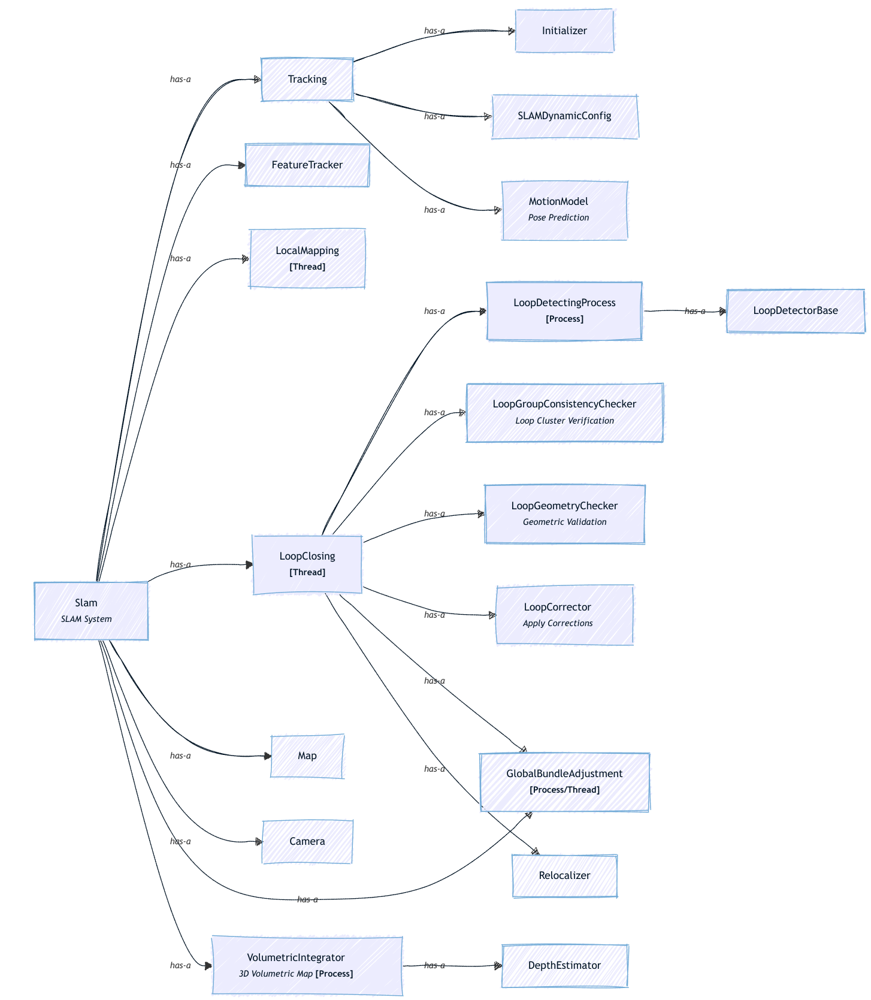
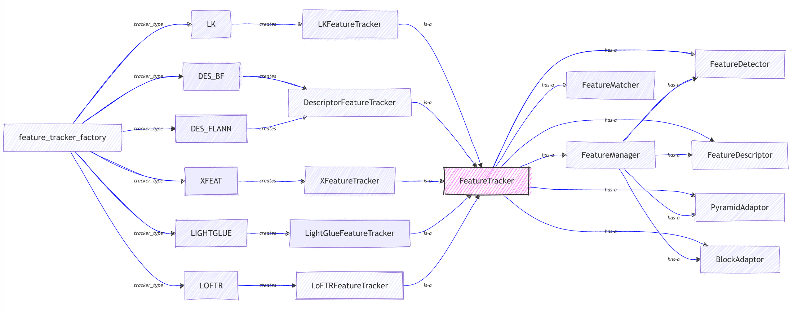
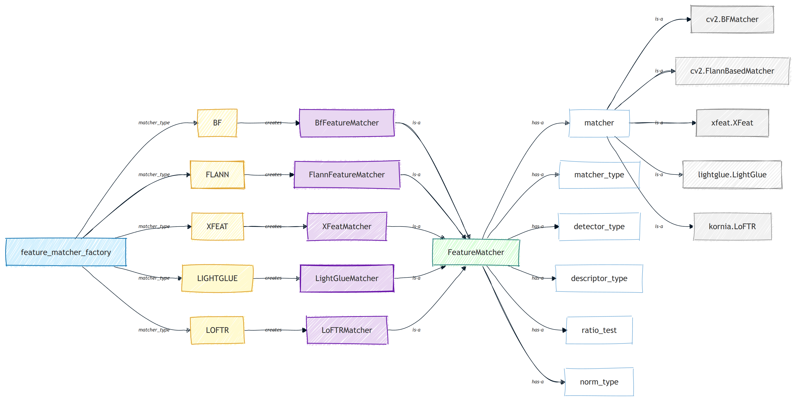
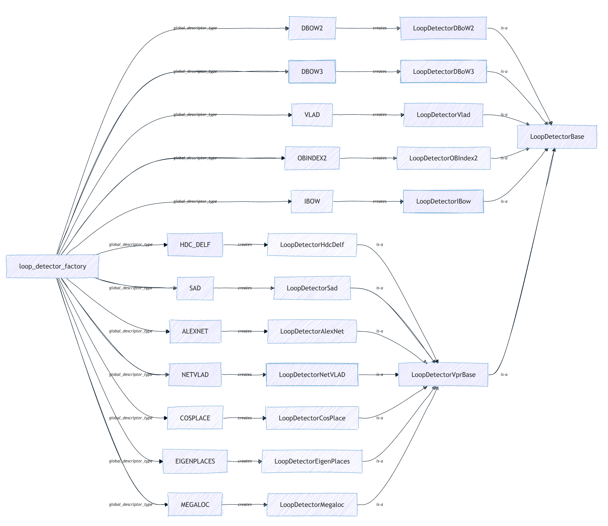
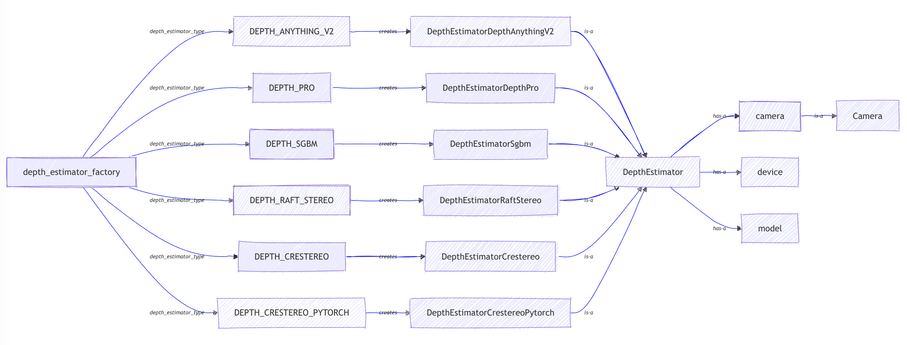

# Architecture

Here are a couple of sketches intended to provide an overview of the main classes' architecture. [WIP] 

---
## SLAM 

 

---
## Feature Tracker

 

---
## Feature Matcher

 

---
## Loop Detector 

 

---
## Depth Estimator 

 

