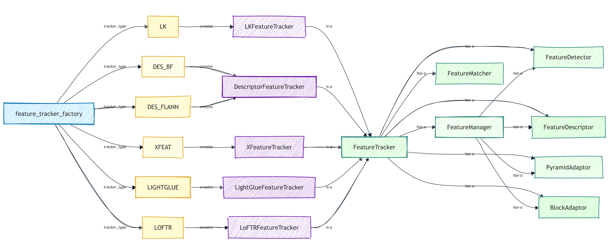

# Architecture

Here you can find a couple of diagram sketches that provide an overview of the main system components, and classes relationships and dependencies. **[WIP]** 

---
## SLAM System

 

**Note**: You might be wondering why I used **Processes** instead of **Threads** in some cases. The reason is that, at least in Python 3.8 (the version supporting pySLAM), only one thread can execute at a time within a single process due to the Global Interpreter Lock (GIL). On the other hand, using multiprocessing (separate processes that do not share the GIL) enables better parallelism.

---
## Feature Tracker

 

---
## Feature Matcher

 

---
## Loop Detector 

 

---
## Depth Estimator 

 

