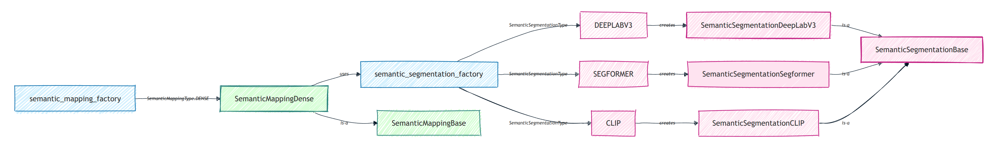

# Semantic Mapping and Segmentation 

The `semantics` module in pySLAM provides **sparse semantic mapping** and **image segmentation** within the SLAM pipeline. It is intended for rapid prototyping, benchmarking, and evaluation of semantic mapping and segmentation methods. When paired with the `volumetric` mapping module, it also enables **semantic volumetric mapping**.

<!-- TOC -->

- [Semantic Mapping and Segmentation](#semantic-mapping-and-segmentation)
  - [Quick test](#quick-test)
  - [Sparse Semantic Mapping](#sparse-semantic-mapping)
    - [Overview](#overview)
    - [Semantic feature types](#semantic-feature-types)
    - [Dense vs Object-Based](#dense-vs-object-based)
  - [Semantic image segmentation](#semantic-image-segmentation)
    - [Supported models](#supported-models)
    - [Dataset type support](#dataset-type-support)
    - [Sparse feature fusion methods](#sparse-feature-fusion-methods)
  - [Volumetric semantic mapping](#volumetric-semantic-mapping)
    - [Overview](#overview-1)
    - [Integration pipeline](#integration-pipeline)
    - [Configuration](#configuration)
    - [Object and instance integration](#object-and-instance-integration)
    - [Practical notes](#practical-notes)
  - [Semantic Mapping Architecture](#semantic-mapping-architecture)
  - [Visualizations](#visualizations)
  - [TODOs](#todos)

<!-- /TOC -->


---
## Quick test

1. Enable sparse semantic mapping and segmentation by setting:
    ```python
    kDoSparseSemanticMappingAndSegmentation=True #  enable sparse mapping and image segmentation
    ```
2. Run the `main_slam.py` example to run Segformer (trained on Cityscapes) on the default KITTI video.

For testing the **open-vocabulary feature**: change the semantic segmentation model to:
```python
kSemanticSegmentationType="CLIP" # in config_parameters.py
```
Then change your query word in `semantic_segmentation_clip.py` to your desire.


---
## Sparse Semantic Mapping 

<p align="center">
  
</p>

### Overview

The _sparse semantic mapping_ module:
- infers semantic information from each keyframe image,
- assigns semantic features to keyframe keypoints,
- and propagates those features to the corresponding sparse map points.

The semantic mapping module runs **after** local mapping refines a keyframe and **before** loop closure and volumetric integration. When `volumetric` mapping is enabled together with the `semantics` module, volumetric integration waits until a keyframe’s semantic prediction is available before processing it.

### Semantic feature types

- **Labels**: categorical class IDs; stored on keypoints/map points and used for fusion, visualization, and semantic weighting.
- **Probability vectors**: per-class confidence/probability scores; fused across observations to estimate robust semantics.
- **Feature vectors**: latent embeddings used for open-vocabulary semantic mapping and similarity-based inference.

### Dense vs Object-Based

The semantic mapping module can potentially be _“dense”_ or _“object-based”_; both are intended to expose the same interface.

The currently implemented version is **Dense**: it runs per-pixel semantic segmentation on keyframe images, assigns semantic descriptors to keypoints, and fuses them into the corresponding sparse map points.

An **Object-based** variant is currently implemented only in combination with the `volumetric` module, where object segments are grouped 3D points with shared semantic class and object IDs (which are still extracted from keyframe images and then backprojected and integrated into voxels).

<!--
- **Object-based** [*WIP*]:
  - Generate, track, and maintain 3D segments as groups of points.
  - Features are assigned at object-level: multiple KPs or MPs share "object descriptors".
  - Possible approaches: project 2D masks and use label fusion and DBSCAN for 3D clustering (WIP). -->

---
## Semantic image segmentation

Segmentation models are implemented on the top of a base class `SemanticSegmentationBase`, which offers the following main methods: 
- `infer`: returns semantic images.
- `sem_img_to_rgb`: converts semantic outputs into color maps.

<p align="center">
  
</p>


### Supported models

The following models are used to run semantic inference:

**Panoptic/Instance segmentation:**
  - `DETIC`: from https://github.com/facebookresearch/Detic
    - Object detection-based (CenterNet2 + CLIP), supports large vocabularies (LVIS/COCO/OpenImages/Objects365).
    - Architecture: Object detector (CenterNet2) detects individual objects first, then segments each detection.
    - Can output both *"instances"* (direct instance segmentation) and *"panoptic_seg"* formats.
    - Instance extraction: Direct from object detections - each detected object = one instance ID.
    - Result: Robust instance segmentation - each detected object gets a unique instance ID, even for multiple objects of the same category (e.g., two pillows = two separate instances).
  - `ODISE`: from https://github.com/NVlabs/ODISE
    - Diffusion-based panoptic segmentation, leverages diffusion models for segmentation.
    - Architecture: Panoptic segmentation model that segments image into regions first, then classifies regions.
    - Only outputs *"panoptic_seg"* format - instances extracted from panoptic segments via *"isthing"* flag.
    - Instance extraction: Derived from panoptic segments - one segment may contain multiple objects if model groups them together (e.g., spatially connected objects of same category).
    - Result: Instance segmentation may merge multiple objects of the same category into a single instance (e.g., two pillows may be detected as one "pillow" instance).
  - `EOV_SEG`: from https://github.com/nhw649/EOV-Seg
    - Dual-backbone (CNN + ViT) with CLIP, text-prompt driven open vocabulary.
    - Architecture: Panoptic segmentation model (similar to ODISE) - segments image into regions first.
    - Only outputs *"panoptic_seg"* format - instances extracted from panoptic segments via *"isthing"* flag.
    - Instance extraction: Same as `ODISE` - derived from panoptic segments, may group multiple objects.
    - Result: Similar to `ODISE`, instance segmentation may group multiple objects of the same category together (e.g., two pillows may be detected as one "pillow" instance).

**Semantic segmentation only:**
  - `DEEPLABV3`: from `torchvision`, pre-trained on COCO/VOC.
    - Semantic segmentation model from torchvision DeepLab's v3.
  - `SEGFORMER`: from `transformers`, pre-trained on Cityscapes or ADE20k.
    - Semantic segmentation model from transformer's Segformer.
  - `CLIP`: from `f3rm` package for open-vocabulary support.
    - Uses CLIP patch embeddings + text similarity to produce labels/probabilities (it is not a dedicated "segmentation head"). 


**Instance segmentation:**
  - `RFDETR`: from https://github.com/roboflow/rf-detr.git
    - RF-DETR instance segmentation; pretrained weights target COCO classes by default.
  - `YOLO`: from https://github.com/ultralytics/ultralytics

### Dataset type support

- Trained for a “dataset type” managing label-color mappings and equivalence mappings.
- Special dataset types for open-vocabulary:
  - **closed_set**: user-defined labels and generic color map
  - **feature_sim**: similarity map based on a query word

### Sparse feature fusion methods

Features are fused from KPs into MPs using one of the fusion methods available [here](../pyslam/semantics/semantic_fusion_methods.py).

---

## Volumetric semantic mapping

<p align="center">
  
</p>

### Overview

Semantic volumetric mapping fuses per-keyframe semantic predictions into a dense 3D voxel grid, enabling semantic-aware reconstruction and optional object-level segmentation. The semantic volumetric integrators live in `pyslam/dense` and rely on semantic predictions produced by `pyslam/semantics`.

Two semantic fusion backends are supported:
- **Confidence-counter fusion** (`VOXEL_SEMANTIC_GRID`): stores the most frequent class with a confidence counter.
- **Probabilistic fusion** (`VOXEL_SEMANTIC_PROBABILISTIC_GRID`): maintains class probability distributions with Bayesian fusion (recommended for robustness).

### Integration pipeline

1. **Semantic prediction**: `SemanticMappingDense` (or `SemanticMappingDenseProcess`) runs asynchronously and produces `semantic_img` and optional `semantic_instances_img` for each keyframe.
2. **Synchronization**: the volumetric integrator waits until a keyframe reports `is_semantics_available()` before integration.
3. **Rectification**: semantic, color, and depth images are rectified/undistorted to match the depth camera model.
4. **Point cloud generation**: depth is converted to 3D points and each point is tagged with its semantic label (and instance ID if available).
5. **Voxel integration**: points are fused into the voxel grid using the selected semantic fusion backend.

### Configuration

Minimal enablement:
```python
kDoSparseSemanticMappingAndSegmentation=True  # enable sparse mapping + semantic prediction
kDoVolumetricIntegration = True              # enable volumetric integration
kVolumetricIntegrationType = "VOXEL_SEMANTIC_PROBABILISTIC_GRID"  # or "VOXEL_SEMANTIC_GRID"
```

Common semantic volumetric parameters (see `pyslam/config_parameters.py`):
- `kVolumetricIntegrationUseVoxelBlocks`: use voxel blocks (memory efficient, default on).
- `kVolumetricIntegrationVoxelGridUseCarving`: enable voxel carving with depth constraints.
- `kVolumetricSemanticProbabilisticIntegrationUseDepth`: enable depth-weighted confidence (probabilistic).
- `kVolumetricSemanticProbabilisticIntegrationDepthThresholdIndoor/Outdoor`: depth threshold for full confidence.
- `kVolumetricSemanticProbabilisticIntegrationDepthDecayRateIndoor/Outdoor`: exponential decay rate beyond threshold.
- `kVolumetricSemanticIntegrationUseInstanceIds`: enable 2D instance-to-3D object association.
- `kVolumetricSemanticIntegrationMinVoteRatio` / `kVolumetricSemanticIntegrationMinVotes`: voting filters for object IDs.

### Object and instance integration

If `kVolumetricSemanticIntegrationUseInstanceIds=True`, the integrator uses 2D instance IDs (from panoptic/instance segmentation backends) to build **3D object segments**. Object IDs are assigned via a voting scheme across observations, filtered by minimum vote ratio and count. This enables:
- 3D object grouping and colorization by instance ID.
- Stable object identities across multiple views.

In particular, use the following GUI buttons to toggle:
- `Colors semantics`: class/label color maps on both the 3D sparse map and the volumetric map.
- `Objects`: per-object color map on the volumetric map (requires instance IDs).
- `Draw object BBs`: bounding boxes for detected 3D object segments.

### Practical notes

- **Synchronization**: When semantic mapping is enabled, volumetric integration waits for semantic predictions before processing keyframes.
- **Performance**: Probabilistic fusion is more accurate but more compute-intensive than confidence counters.
- **Memory**: Voxel blocks reduce memory at large scales (`kVolumetricIntegrationUseVoxelBlocks=True`).

Further information about volumetric integration models and implementation details are available in [cpp/volumetric/README.md](../cpp/volumetric/README.md).

--- 


## Semantic Mapping Architecture

<p align="center">
 
</p>

This diagram outlines the architecture of the *Semantic Mapping* module. At its core is the `semantic_mapping_factory`, which creates semantic mapping instances according to the selected `semantic_mapping_type`. Currently, the supported type is `DENSE`, which instantiates either the `SemanticMappingDense` class or the `SemanticMappingDenseProcess` class if `Parameters.kSemanticMappingMoveSemanticSegmentationToSeparateProcess=True`. Both these classes extend `SemanticMappingDenseBase` and runs asynchronously in a dedicated thread to process keyframes as they become available. In particular, the `SemanticMappingDenseProcess` class offloads semantic segmentation inference to a separate process, thereby making better use of CPU core parallelism.

`SemanticMappingDense` and `SemanticMappingDenseProcess` integrate semantic information into the SLAM map by leveraging per-keyframe predictions from a semantic segmentation model. The segmentation model is instantiated via the `semantic_segmentation_factory`, based on the selected `semantic_segmentation_type`. Supported segmentation backends include `DEEPLABV3`, `SEGFORMER`, `CLIP`, `EOV_SEG`, `DETIC`, `RFDETR`, `YOLO`, and `ODISE`, each of which corresponds to a dedicated class (`SemanticSegmentationDeepLabV3`, `SemanticSegmentationSegformer`, `SemanticSegmentationCLIP`, `SemanticSegmentationEovSeg`, `SemanticSegmentationDetic`, `SemanticSegmentationRfDetr`, `SemanticSegmentationYolo`, and `SemanticSegmentationOdise`) inheriting from the shared `SemanticSegmentationBase`.

The system supports multiple semantic feature representations - such as categorical labels, probability vectors, and high-dimensional feature embeddings - and fuses them into the map using configurable methods like count-based fusion, Bayesian fusion, or feature averaging.

This modular design decouples semantic segmentation from mapping logic, enabling flexible combinations of segmentation models, datasets (e.g., NYU40, Cityscapes), and fusion strategies. It also supports customization via configuration files or programmatic APIs for dataset-specific tuning or deployment.

The section [Supported semantic segmentation methods](../README.md#supported-semantic-segmentation-methods) provides a list of supported semantic segmentation methods.

This paper provides a presentation of the first version of sparse semantic mapping module.
*["Semantic pySLAM: Unifying semantic mapping approaches under the same framework"](./pyslam-semantic.pdf)*, David Morilla-Cabello, Eduardo Montijano  

---

## Visualizations

**Sparse semantic mapping**

It is possible to visualize both in 2D and 3D the:
- Label color maps of the sparse map points.
- Similarity heatmaps (open vocab).

<!-- ### Dataset Support

- **Scannet** is supported with GT pose and GT semantics.
- Evaluation done with Segformer on ADE20k + class mapping. -->

**Volumetric semantic mapping**

When volumetric semantic mapping is enabled, use the SLAM GUI to toggle:
- `Colors semantics`: class/label color maps on both the 3D sparse map and the volumetric map.
- `Objects`: per-object color map on the volumetric map (requires instance IDs).
- `Draw object BBs`: bounding boxes for detected 3D object segments.


---
## TODOs

- [ ] Investigate variants in KF count for `LABEL` vs `PROBABILITY_VECTOR`
- [ ] Implement object-level semantic mapping [WIP]
- [ ] Add interaction in 3D viewer to change query word (open-vocab)
