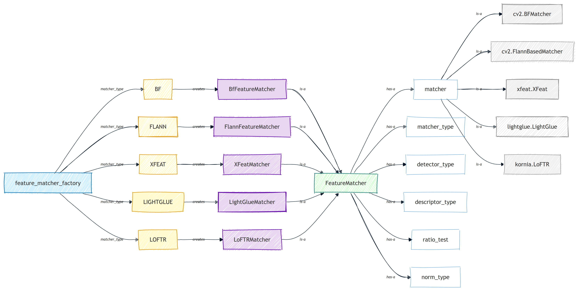
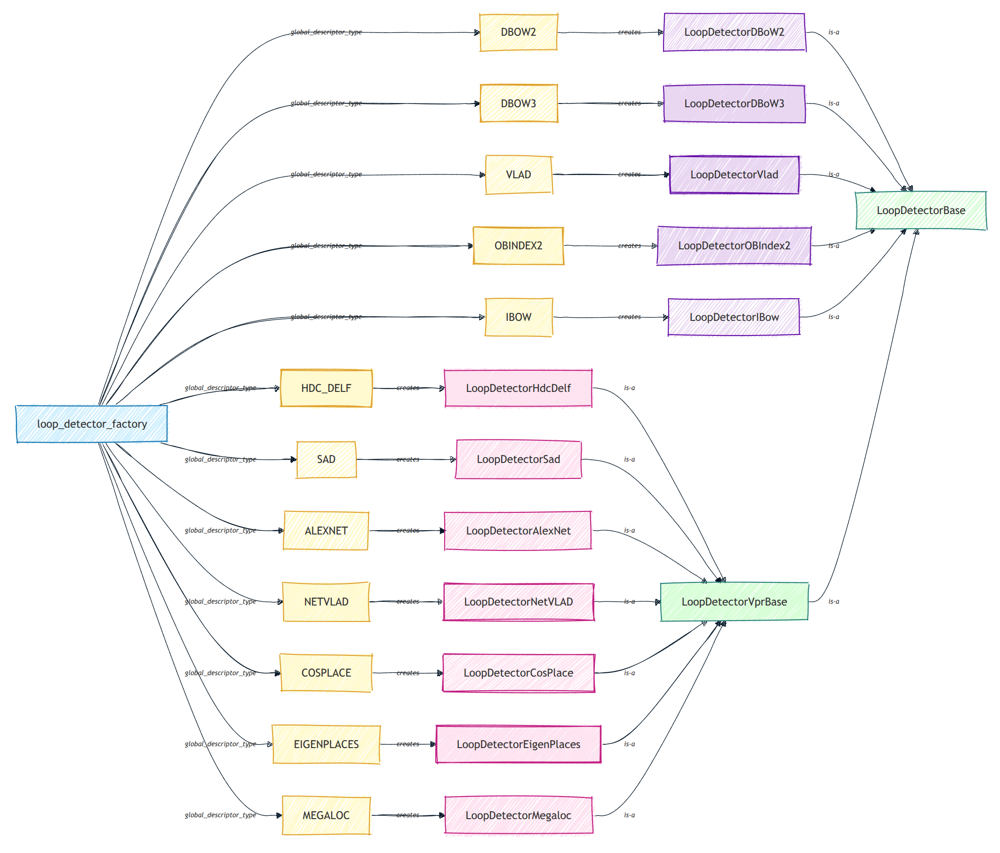
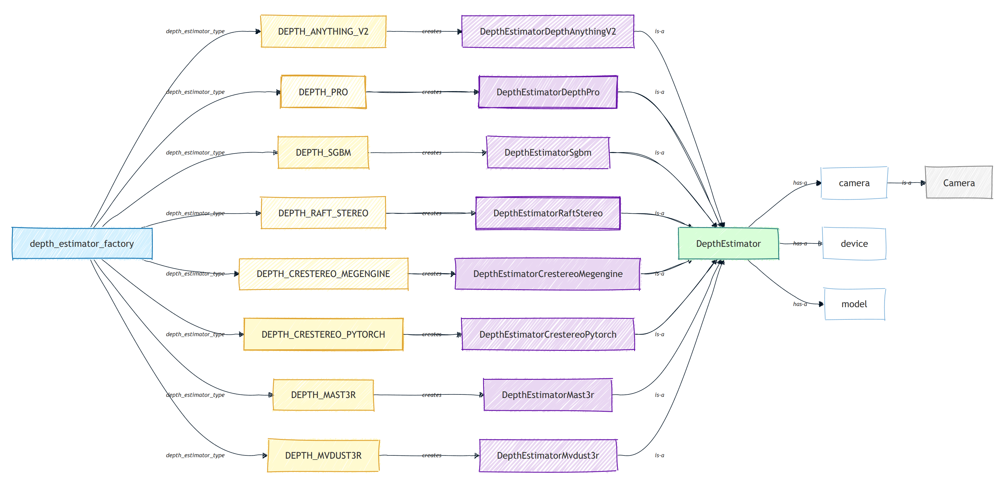
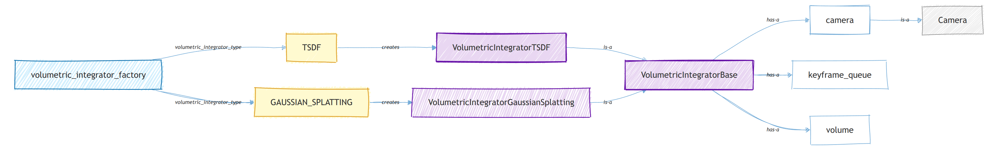

# System Overview

<!-- TOC -->

- [System Overview](#system-overview)
    - [1. SLAM Workflow and Components](#1-slam-workflow-and-components)
    - [2. Main System Components](#2-main-system-components)
        - [2.1. Feature Tracker](#21-feature-tracker)
        - [2.2. Feature Matcher](#22-feature-matcher)
        - [2.3. Loop Detector](#23-loop-detector)
        - [2.4. Depth Estimator](#24-depth-estimator)
        - [2.5. Volumetric Integrator](#25-volumetric-integrator)
        - [2.6. Semantic Mapping](#26-semantic-mapping)
    - [3. C++ Core](#3-c-core)

<!-- /TOC -->

This page offers a high-level overview of the system, featuring diagrams that illustrate the main workflow, core components, and key class relationships or dependencies. For readability, certain minor elements and arrows have been intentionally omitted. A more detailed version of this content is available in this [PDF document](./tex/document.pdf).

**paper**: ["pySLAM: An Open-Source, Modular, and Extensible Framework for SLAM"](https://arxiv.org/abs/2502.11955), *Luigi Freda*      
You may find an updated version of the paper [here](./docs/tex/document.pdf).

**presentation**: [_"pySLAM and slamplay: Modular, Extensible SLAM Tools for Rapid Prototyping and Integration"_](https://docs.google.com/presentation/d/e/2PACX-1vSHoOR5-oiL7yDkowOe3mCbPvq4-qZzmWWZFswvCEiSMLkyUQoXgoODiG4GZL8pMpKTqqJUZ3auk0T-/pub?start=false&loop=false&delayms=3000), *Luigi Freda*    
RSS 2025 Workshop: _Unifying Visual SLAM_. The **recorded talk** is available [here](https://www.youtube.com/watch?v=OsS4XzVDSj4).

---

## SLAM Workflow and Components

 

This figure illustrates the SLAM workflow, which is composed of **six main parallel processing modules**:

- **Tracking**: estimates the camera pose for each incoming frame by extracting and matching local features to the local map, followed by minimizing the reprojection error through motion-only Bundle Adjustment (BA). It includes components such as pose prediction (or relocalization), feature tracking, local map tracking, and keyframe decision-making.

- **Local Mapping**: updates and refines the local map by processing new keyframes. This involves culling redundant map points, creating new points via temporal triangulation, fusing nearby map points, performing Local BA, and pruning redundant local keyframes.

- **Loop Closing**: detects and validates loop closures to correct drift accumulated over time. Upon loop detection, it performs loop group consistency checks and geometric verification, applies corrections, and then launches Pose Graph Optimization (PGO) followed by a full Global Bundle Adjustment (GBA). Loop detection itself is delegated to a parallel process, the *Loop Detector*, which operates independently for better responsiveness and concurrency.

- **Global Bundle Adjustment**: triggered by the Loop Closing module after PGO, this step globally optimizes the trajectory and the sparse structure of the map to ensure consistency across the entire sequence.

- **Volumetric Integration**: uses the keyframes, with their estimated poses and back-projected point clouds, to reconstruct a dense 3D map of the environment. This module optionally integrates predicted depth maps and maintains a volumetric representation such as a TSDF or Gaussian Splatting-based volume.

- **Semantic Mapping**: enriches the SLAM map with dense semantic information by applying pixel-wise segmentation to selected keyframes. Semantic predictions are fused across views to assign semantic labels or descriptors to keyframes and map points. The module operates in parallel, consuming keyframes and associated image data from a queue, applying a configured semantic segmentation model, and updating the map with fused semantic features. This enables advanced downstream tasks such as semantic navigation, scene understanding, and category-level mapping.

The first four modules follow the established PTAM and ORB-SLAM paradigm. Here, the Tracking module serves as the front-end, while the remaining modules operate as part of the back-end.

In parallel, the system constructs two types of maps:
- The sparse map ${\cal M}_s = ({\cal K}, {\cal P})$, composed of a set of keyframes ${\cal K}$ and 3D points ${\cal P}$ derived from matched features.
- The volumetric/dense map ${\cal M}_v$, constructed by the Volumetric Integration module, which fuses back-projected point clouds from the keyframes ${\cal K}$ into a dense 3D model.

To ensure consistency between the sparse and volumetric representations, the volumetric map is updated or re-integrated whenever global pose adjustments occur (e.g., after loop closures).

 

This other figure details the internal components and interactions of the above modules. In certain cases, **processes** are employed instead of **threads**. This is due to Python's Global Interpreter Lock (GIL), which prevents concurrent execution of multiple threads in a single process. The use of multiprocessing circumvents this limitation, enabling true parallelism at the cost of some inter-process communication overhead (e.g., via pickling). For an insightful discussion, see this related [post](https://www.theserverside.com/blog/Coffee-Talk-Java-News-Stories-and-Opinions/Is-Pythons-GIL-the-software-worlds-biggest-blunder).

---

## Main System Components

### Feature Tracker

 

The *Feature Tracker* consists of the following key sub-components:

- *Feature Manager*: Manages local feature operations. It includes the `FeatureDetector`, `FeatureDescriptor`, and adaptors for pyramid management and image tiling.  
  - *Feature Detector*: Identifies salient and repeatable keypoints in the image—such as corners or blobs, that are likely to be robust under viewpoint and illumination changes.  
  - *Feature Descriptor*: Computes a distinctive descriptor for each detected keypoint, capturing its local appearance to enable robust matching across frames. Examples include `ORB2`, `SIFT`, and `SuperPoint`.

- *Feature Matcher*: Establishes correspondences between features in successive frames (or stereo pairs) by comparing their descriptors or directly inferring matches from image content. Matching can be performed using brute-force, k-NN with ratio test, or learned matching strategies. Refer to the section [Feature Matcher](#feature-matcher) below for more details.

See the section [Supported local features](../README.md#supported-local-features) for a list of supported feature detectors and descriptors.

The last diagram above presents the architecture of the *Feature Tracker* system. It is organized around a `feature_tracker_factory`, which instantiates specific tracker types such as `LK`, `DES_BF`, `DES_FLANN`, `XFEAT`, `LIGHTGLUE`, and `LOFTR`. Each tracker type creates a corresponding implementation (e.g., `LKFeatureTracker`, `DescriptorFeatureTracker`, etc.), all of which inherit from a common `FeatureTracker` interface.

The `FeatureTracker` class is composed of several key sub-components, including a `FeatureManager`, `FeatureDetector`, `FeatureDescriptor`, `PyramidAdaptor`, `BlockAdaptor`, and `FeatureMatcher`. The `FeatureManager` itself encapsulates instances of the detector, descriptor, and adaptors, highlighting the modular and reusable design of the tracking pipeline.

### Feature Matcher

 

This last diagram illustrates the architecture of the *Feature Matcher* module. At its core is the `feature_matcher_factory`, which instantiates matchers based on a specified `matcher_type`, such as `BF`, `FLANN`, `XFEAT`, `LIGHTGLUE`, and `LOFTR`. Each of these creates a corresponding matcher implementation (e.g., `BfFeatureMatcher`, `FlannFeatureMatcher`, etc.), all inheriting from a common `FeatureMatcher` interface.

The `FeatureMatcher` class encapsulates several configuration parameters and components, including the matcher engine (`cv2.BFMatcher`, `FlannBasedMatcher`, `xfeat.XFeat`, etc.), as well as the `matcher_type`, `detector_type`, `descriptor_type`, `norm_type`, and `ratio_test` fields. This modular structure supports extensibility and facilitates switching between traditional and learning-based feature matching backends.

The section [Supported matchers](../README.md#supported-matchers) reports a list of supported feature matchers.

### Loop Detector 

 

This diagram shows the architecture of the *Loop Detector* component. A central `loop_detector_factory` instantiates loop detectors based on the selected `global_descriptor_type`, which may include traditional descriptors (e.g., `DBOW2`, `VLAD`, `IBOW`) or deep learning-based embeddings (e.g., `NetVLAD`, `CosPlace`, `EigenPlaces`, `Megaloc`).

Each descriptor type creates a corresponding loop detector implementation (e.g., `LoopDetectorDBoW2`, `LoopDetectorNetVLAD`), all of which inherit from a base class hierarchy. Traditional methods inherit directly from `LoopDetectorBase`, while deep learning-based approaches inherit from `LoopDetectorVprBase`, which itself extends `LoopDetectorBase`. This design supports modular integration of diverse place recognition techniques within a unified loop closure framework.

The section [Supported loop closing methods](../README.md#supported-global-descriptors-and-local-descriptor-aggregation-methods) reports a list of supported loop closure methods with the adopted global descriptors and local descriptor aggregation methods.

### Depth Estimator 

 

The last diagram illustrates the architecture of the *Depth Estimator* module. A central `depth_estimator_factory` creates instances of various depth estimation backends based on the selected `depth_estimator_type`, including both traditional and learning-based methods such as `DEPTH_SGBM`, `DEPTH_RAFT_STEREO`, `DEPTH_ANYTHING_V2`, `DEPTH_MAST3R`, and `DEPTH_MVDUST3R`.

Each estimator type instantiates a corresponding implementation (e.g., `DepthEstimatorSgbm`, `DepthEstimatorCrestereoMegengine`, etc.), all inheriting from a common `DepthEstimator` interface. This base class encapsulates shared dependencies such as the `camera`, `device`, and `model` components, allowing for modular integration of heterogeneous depth estimation techniques across stereo, monocular, and multi-view pipelines.

The section [Supported depth prediction models](../README.md#supported-depth-prediction-models) provides a list of supported depth estimation/prediction models.

### Volumetric Integrator

 

This diagram illustrates the structure of the *Volumetric Integrator* module. At its core, the `volumetric_integrator_factory` generates specific volumetric integrator instances based on the selected `volumetric_integrator_type`, such as `VOXEL_GRID`, `VOXEL_SEMANTIC_GRID`, `VOXEL_SEMANTIC_PROBABILISTIC_GRID`, `TSDF` and `GAUSSIAN_SPLATTING`.

Each type instantiates a dedicated implementation (e.g., `VolumetricIntegratorVoxelGrid`, `VolumetricIntegratorVoxelSemanticGrid`, `VolumetricIntegratorTSDF`, `VolumetricIntegratorGaussianSplatting`), which inherits from a common `VolumetricIntegratorBase`. This base class encapsulates key components including the `camera`, a `keyframe_queue`, and the `volume`, enabling flexible integration of various 3D reconstruction methods within a unified pipeline.

The section [Supported volumetric mapping methods](../README.md#supported-volumetric-mapping-methods) provides a list of supported volume integration methods.

### Semantic Mapping

 

This diagram outlines the architecture of the *Semantic Mapping* module. At its core is the `semantic_mapping_factory`, which creates semantic mapping instances according to the selected `semantic_mapping_type`. Currently, the supported type is `DENSE`, which instantiates either the `SemanticMappingDense` class or the `SemanticMappingDenseProcess` class if `Parameters.kSemanticMappingMoveSemanticSegmentationToSeparateProcess=True`. Both these classes extend `SemanticMappingDenseBase` and runs asynchronously in a dedicated thread to process keyframes as they become available. In particular, the `SemanticMappingDenseProcess` class offloads semantic segmentation inference to a separate process, thereby making better use of CPU core parallelism.

`SemanticMappingDense` and `SemanticMappingDenseProcess` integrate semantic information into the SLAM map by leveraging per-keyframe predictions from a semantic segmentation model. The segmentation model is instantiated via the `semantic_segmentation_factory`, based on the selected `semantic_segmentation_type`. Supported segmentation backends include `DEEPLABV3`, `SEGFORMER`, and `CLIP`, each of which corresponds to a dedicated class (`SemanticSegmentationDeepLabV3`, `SemanticSegmentationSegformer`, `SemanticSegmentationCLIP`) inheriting from the shared `SemanticSegmentationBase`.

The system supports multiple semantic feature representations - such as categorical labels, probability vectors, and high-dimensional feature embeddings - and fuses them into the map using configurable methods like count-based fusion, Bayesian fusion, or feature averaging.

This modular design decouples semantic segmentation from mapping logic, enabling flexible combinations of segmentation models, datasets (e.g., NYU40, Cityscapes), and fusion strategies. It also supports customization via configuration files or programmatic APIs for dataset-specific tuning or deployment.

The section [Supported semantic segmentation methods](../README.md#supported-semantic-segmentation-methods) provides a list of supported semantic segmentation methods.

This paper provides a more in-depth presentation of the semantic mapping module.
*["Semantic pySLAM: Unifying semantic mapping approaches under the same framework"](./pyslam-semantic.pdf)*, David Morilla-Cabello, Eduardo Montijano  

## C++ Core

A brief overview of the C++ core is provided in this [document](../pyslam/slam/cpp/README.md).

