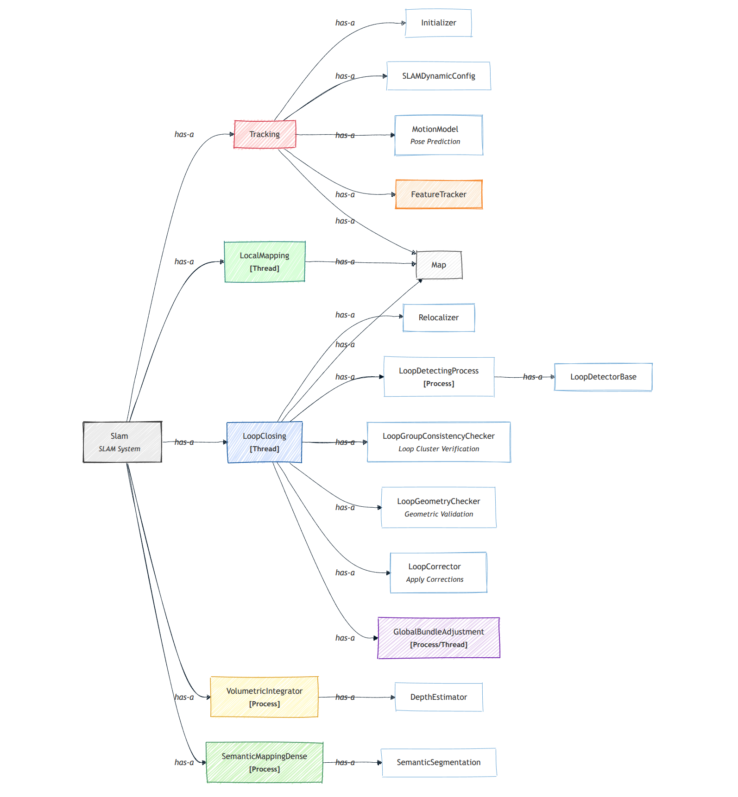

# System Overview

<!-- TOC -->

- [System Overview](#system-overview)
  - [SLAM Workflow](#slam-workflow)
  - [SLAM Components](#slam-components)
  - [Main System Components](#main-system-components)
    - [Feature Tracker](#feature-tracker)
    - [Feature Matcher](#feature-matcher)
    - [Loop Detector](#loop-detector)
    - [Depth Estimator](#depth-estimator)
    - [Volumetric Integrator](#volumetric-integrator)

<!-- /TOC -->

In this document, you can find a couple of diagram sketches that provide an overview of the main workflow, system components, and classes relationships/dependencies.

---

## SLAM Workflow

 

---
## SLAM Components

 

**Note**: You might be wondering why I used **Processes** instead of **Threads** in some cases. The reason is that, at least in Python 3.8 (the version supporting pySLAM), only one thread can execute at a time within a single process due to the Global Interpreter Lock (GIL). On the other hand, using multiprocessing (separate processes that do not share the GIL) enables better parallelism. See this nice [post](https://www.theserverside.com/blog/Coffee-Talk-Java-News-Stories-and-Opinions/Is-Pythons-GIL-the-software-worlds-biggest-blunder).

---

## Main System Components

### Feature Tracker

 

### Feature Matcher

 

### Loop Detector 

 

### Depth Estimator 

 

### Volumetric Integrator

 

