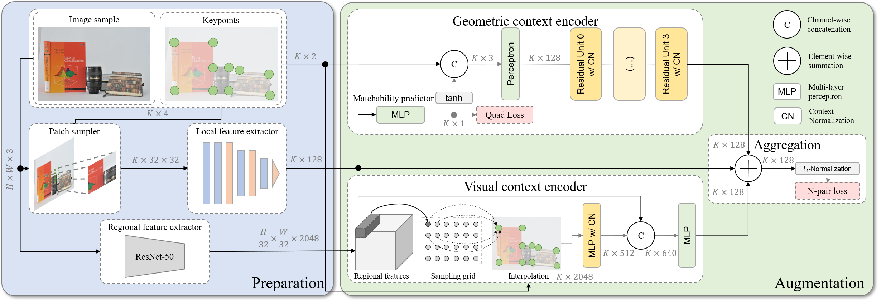

# ContextDesc implementation

forked from [https://github.com/lzx551402/contextdesc], commit 59b41c2d39b909566bdfdadfe45dd372aca060c1     




TensorFlow implementation of ContextDesc for CVPR'19 paper (oral) ["ContextDesc: Local Descriptor Augmentation with Cross-Modality Context"](https://arxiv.org/abs/1904.04084), by Zixin Luo, Tianwei Shen, Lei Zhou, Jiahui Zhang, Yao Yao, Shiwei Li, Tian Fang and Long Quan.

This paper focuses on augmenting off-the-shelf local feature descriptors with two types of context: the visual context from high-level image representation, and geometric context from keypoint distribution. If you find this project useful, please cite:

```
@article{luo2019contextdesc,
  title={ContextDesc: Local Descriptor Augmentation with Cross-Modality Context},
  author={Luo, Zixin and Shen, Tianwei and Zhou, Lei and Zhang, Jiahui and Yao, Yao and Li, Shiwei and Fang, Tian and Quan, Long},
  journal={Computer Vision and Pattern Recognition (CVPR)},
  year={2019}
}
```

## Requirements

Please use Python 3.6, install NumPy, OpenCV (3.4.2), OpenCV-Contrib (3.4.2) and TensorFlow (1.14.0). Refer to [requirements.txt](requirements.txt) for some other dependencies.

## Pre-trained model

We provide both the Protobuf files (for a quick start) and checkpoint files (for research purposes) for restoring the pre-trained weights, including

```
<contextdesc_model>
        ├── loc.pb (weights of the local feature model and matchability predictor)
        ├── aug.pb (weights of the augmentation model) 
        └── model.ckpt-* (checkpoint files for both the local feature model and agumentation model)
```

Several variants of ContextDesc as in the paper are provided for study.

| Name            | Downloads                                                                         | Descriptions                                                                                                                                                                                                                                                               |
|-----------------|-----------------------------------------------------------------------------------|----------------------------------------------------------------------------------------------------------------------------------------------------------------------------------------------------------------------------------------------------------------------------|
| Retrieval model | [Link](https://research.altizure.com/data/contextdesc_models/retrieval_model.tar) | (Regional feature) An image retrieval model trained on [Google-Landmarks Dataset](https://www.kaggle.com/google/google-landmarks-dataset) that provides high-level image representation to enrich visual context. More details can be found in the supplementary material. |
| ContextDesc| [Link](https://research.altizure.com/data/contextdesc_models/contextdesc.tar)     | (Base) Use [GeoDesc](https://github.com/lzx551402/geodesc) [[1]](#refs) (ECCV'18) as the local feature model, and train only the augmentation model.                                                                                                                       |
| ContextDesc+    | [Link](https://research.altizure.com/data/contextdesc_models/contextdesc_p.tar)    | (Better) Train the local feature model and augmentation model separately with the proposed scale-aware N-pair loss.                                                                                                                                                        |
| ContextDesc++   | [Link](https://research.altizure.com/data/contextdesc_models/contextdesc_pp.tar)   | (Best) End-to-end train both the local feature and augmentation models.                                                                                                                                                                                                    |
| Dense-ContextDesc| [Link](https://research.altizure.com/data/contextdesc_models/dense-contextdesc.tar)   | Densely extract features from the entire input image (instead of image patch). Details can be found [here](docs/dense_model.md).|

The TensorFlow network definition can be found [here](models/cnn_wrapper). An usage is provided along with the [image matching example](image_matching.py).

# Training data

Part of the training data is released in [GL3D](https://github.com/lzx551402/GL3D). Please also cite [MIRorR](https://github.com/hlzz/mirror) [[2]](#refs) if you find this dataset useful for your research.

## Example scripts

### 1. Test image matching

To get started, clone the repo and download the pretrained model (take `ContextDesc++` as an example):
```bash
git clone https://github.com/lzx551402/contextdesc.git && \
cd /local/contextdesc/pretrained && \
wget https://research.altizure.com/data/contextdesc_models/contextdesc_pp.tar && \
tar -xvf contextdesc_pp.tar
```

then simply call:

```bash
cd /local/contextdesc && python image_matching.py
```

The matching results from SIFT features (top), raw local features (middle) and augmented features (bottom) will be displayed. 

- To test the performance of a dense model, call the script with `--dense_desc`. 
- To use the TensorFlow checkpoint file for parameter restoring, call the script with `--type ckpt`.
- Type `python image_matching.py --h` to view more options and test on your own images.

### 2. Evaluation on HPatches Sequences 

First, download [HPSequences](http://icvl.ee.ic.ac.uk/vbalnt/hpatches/hpatches-sequences-release.tar.gz) (full image sequences of [HPatches](https://github.com/hpatches/hpatches-dataset) [[3]](#refs) and their corresponding homographies).

Second, download our CVPR intermediate results of keypoint locations and image patches for HPSequences ([Link](https://research.altizure.com/data/contextdesc_models/hseq_cvpr.tar)).

Unzip the above two downloads in the same folder, and you will find each .ppm image aside with a .pkl file.

Finally, to reproduce our CVPR results, configure the data root in `configs/hseq_eval.yaml`, and call call the evaluation script by:

```bash
cd /local/contextdesc && python hseq_eval.py --function hseq_eval --config configs/hseq_eval.yaml
```

For ContextDesc++, you will see Recall of 67.35/77.33 for i/v sequences, similar to the results reported in the original paper (67.53/77.20).

The updated results can be obtained by setting `suffix` to null in `configs/hseq_eval.yaml`. Due to some tweakings on the keypoint detector and patch extractor, it yields better results, i.e., 70.10/78.83 for i/v sequences.

To test Dense-ContextDesc, set `suffix` to null and `dense_desc` to true in `configs/hseq_eval.yaml`, and it will give 76.95/75.58 for i/v sequences. It shows that a dense prediction (with a global input normalization) is benefical for illumination change. However, since scale/rotation changes are handled in the intermediate feature maps, the perspective invariance is weakened.

### 3. Benchmark on image matching

ContextDesc, together with a learned matcher [[4]](#refs), won both the stereo and muti-view image matching tracks at [IMW2019](https://image-matching-workshop.github.io/). We provide the script that prepares the ContextDesc features and formats the submission files to this challenge.

To get started, follow the [challenge instructions](https://github.com/vcg-uvic/sfm_benchmark_release) to download the [test data](http://webhome.cs.uvic.ca/~kyi/files/2019/image-matching/imw2019-test.tar.gz).

Next, configure the data paths (`data_root`, `dump_root` and `submission_root`) in `configs/imw2019_eval.yaml`.

Then call the evaluation script by:

```bash
cd /local/contextdesc && python evaluations.py --config configs/imw2019_eval.yaml
```

You may then compress and submit the results to the challenge website. 

### 4. Benchmark on visual localization

ContextDesc also achieved competitive results on [visual localization benchmark](https://www.visuallocalization.net/). Please download [Aachen Day-Night dataset](https://www.visuallocalization.net/datasets/) and follow the [evaluation instructions](https://github.com/tsattler/visuallocalizationbenchmark) to prepare the evaluation data.

Next, configure the data paths (`data_root` and `dump_root`) in `configs/aachen_eval.yaml`

Then extract the features by:

```bash
cd /local/contextdesc && python evaluations.py --config configs/aachen_eval.yaml
```

The extracted features will be saved alongside their corresponding images, e.g., the features for image `/local/Aachen_Day-Night/images/images_upright/db/1000.jpg` will be in the file `/local/Aachen_Day-Night/images/image_upright/db/1000.jpg.contextdesc10k_upright` (the method name here is `contextdesc10k_upright`).

Finally, refer to the [evaluation script](https://github.com/tsattler/visuallocalizationbenchmark) to generate and submit the results to the challenge website.

## Notes
Refer to [example configuration file](configs/example.yaml) on how to evaluate with different settings.

## References
<a name="refs"></a>

[1] GeoDesc: Learning Local Descriptors by Integrating Geometry Constraints, Zixin Luo, Tianwei Shen, Lei Zhou, Siyu Zhu, Runze Zhang, Yao Yao, Tian Fang, Long Quan, ECCV 2018.

[2] Matchable Image Retrieval by Learning from Surface Reconstruction, Tianwei Shen*, Zixin Luo*, Lei Zhou, Runze Zhang, Siyu Zhu, Tian Fang, Long Quan, ACCV 2018.

[3] HPatches: A benchmark and evaluation of handcrafted and learned local descriptors, Vassileios Balntas*, Karel Lenc*, Andrea Vedaldi and Krystian Mikolajczyk, CVPR 2017.

[4] Learning Two-View Correspondences and Geometry Using Order-Aware Network, Jiahui Zhang*, Dawei Sun*, Zixin Luo, Anbang Yao, Lei Zhou, Tianwei Shen, Yurong Chen, Long Quan, Hongen Liao, ICCV 2019.

## Changelog

### 2020-1-13
- Add HPatches Sequences evaluation.

### 2019-7-18
- Add TensorFlow network definition.

### 2019-7-17
- A major code refactorying.
- Add evaluation instructions on image matching and visual localization benchmark.
- Add experimental Dense-ContextDesc model.
