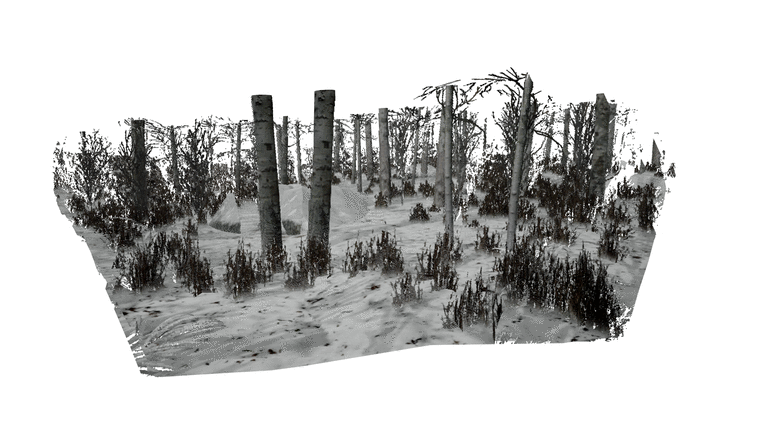

## SE3 / Sim3 Registration
Estimate the 3D transformation between two RGB-D frames



### Models
| Model     | Rot. Acc. | Tr. Acc. | Scale Acc. |
| --------- | --------- | -------- | ---------- |
| [se3.pth](https://drive.google.com/file/d/17pgeY5m-GXnrY3oFLPRaIrTZYvae_l9u/view?usp=sharing)   | 91.90         | 77.70 | -     |
| [sim3.pth](https://drive.google.com/file/d/1LMnKND_4DAmd9DMTSKdz_zAoCgja6X43/view?usp=sharing)  | 93.45         | 76.05 | 98.70 |

for thresholds 0.1 deg. rotation error, 1cm translation error, and 1% scale error.

### Demo 
Download one of the models to run the demo (requres Open3D)
```python
python demo.py --transformation=SE3 --ckpt=se3.pth
python demo.py --transformation=Sim3 --ckpt=sim3.pth
```

### Training and Evaluation
Training and evaluation is performed on the [TartanAir](https://theairlab.org/tartanair-dataset/) (only depth_left and image_left need to be downloaded). Note: our dataloader computes the optical flow between every pair of frames which can take several hours on the first run. However, this result is cached so that future loads will only take a few seconds.

The training script expects the dataset to be in the directory datasets/TartanAir.

To train a Sim3 network:
```python
python main.py --train --transformation=Sim3 --name=sim3
```
A trained model can then be evaluated:
```python
python main.py --transformation=Sim3 --ckpt=sim3.pth
```

