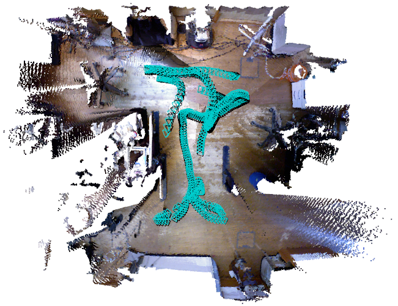
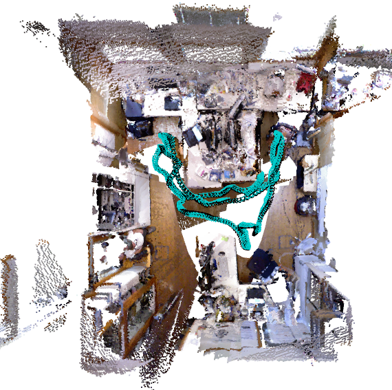

## RGB-D SLAM / VO


 


### Pretrained Model

Absolute Trajectory Error (ATE) on all freiburg1 sequences. The default model acts as a visual odometry system (no loop closure). The model rgbdslam.pth + go performs global optimization at the end of tracking to correct for drift.

| Model  | 360 | desk | desk2 | floor | plant | room | rpy | teddy | xyz | avg |
| -----  | --- | ---- | ----- | ----- | ----- | ---- | --- | ----- | --- | --- |
| DeepV2D | 0.072 | 0.069 | 0.074 | 0.317 | 0.046 | 0.213 | 0.082 | 0.114 | 0.028 | 0.113 |
| [lietorch_rgbdslam.pth](https://drive.google.com/file/d/1SVQTFCchZuhFeSucS5jLeNbOWyff4BA8/view?usp=sharing) | 0.076 | 0.045 | 0.054 | 0.057 | 0.032 | 0.143 | 0.064 | 0.092 | 0.033 | 0.066 |
| [lietorch_rgbdslam.pth](https://drive.google.com/file/d/1SVQTFCchZuhFeSucS5jLeNbOWyff4BA8/view?usp=sharing) + go | 0.047 | 0.018 | 0.023 | 0.017 | 0.015 | 0.029 | 0.019 | 0.030 | 0.009 | 0.023 |

### Demo
Requires a GPU with at least 8gb of memory. First download a sequence from the [TUM-RGBD dataset](https://vision.in.tum.de/data/datasets/rgbd-dataset/download), then run the demo. You can interact with the Open3D window during tracking.

```python
python demo.py --ckpt=lietorch_rgbdslam.pth --datapath=<sequence path> --frame_rate=8.0 --go --viz
```

The `--frame_rate` flag determines the rate images are subsampled from the video (e.g `--frame_rate=8.0` subsamples the video at a rate of 8 fps). With a RTX-3090 GPU and visualization disabled, `--frame_rate <= 8.0` gives real-time performance.


### Evaluation
Assuming all TUM-RGBD sequences have been download, a trained model can be evaluated on the TUM-RGBD dataset
```
python evaluate.py --ckpt=rgbdslam.pth --datapath=<tum-rgbd root> --go --frame_rate=8.0
```

### Training
We provide data_loaders for [NYUv2](https://cs.nyu.edu/~silberman/datasets/nyu_depth_v2.html), [ScanNet](http://www.scan-net.org/), [ETH3D-SLAM](https://www.eth3d.net/slam_datasets), and [TartanAir](https://theairlab.org/tartanair-dataset/). The dataloaders will work directly on ScanNet, ETH3D, and TartanAir. For NYUv2, you will need to first extract the depths and images from the raw format then run ORB-SLAM2 to generate psuedo-groundtruth poses. Send me an email (Zachary Teed) if you need a link to the preprocessed NYU data.

You can train on any subset of the datasets by listing their keys {`nyu`, `scannet`, `eth`, `tartan`}. The provided models are trained on scannet and nyu. Note: our dataloader computes the optical flow between every pair of frames which can take several hours on the first run. However, this result is cached so that future loads will only take a few seconds. The default training setttings require a GPU with 24 Gb of memory.

```
python train.py --batch=3 --iters=12 --lr=0.00025 --name nyu_scannet_eth_v2 --datasets nyu scannet
```

#### Training on your own dataset
Additional datasets can easily be added by subclassing `RGBDDataset`, see `nyu2.py` or `scannet.py` as examples. To verify the dataloading is correct, you can use the `reprojection_test.py` script to verify that the warped images align.
